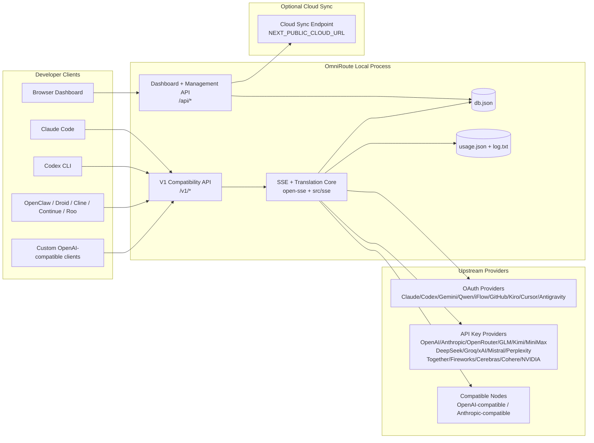
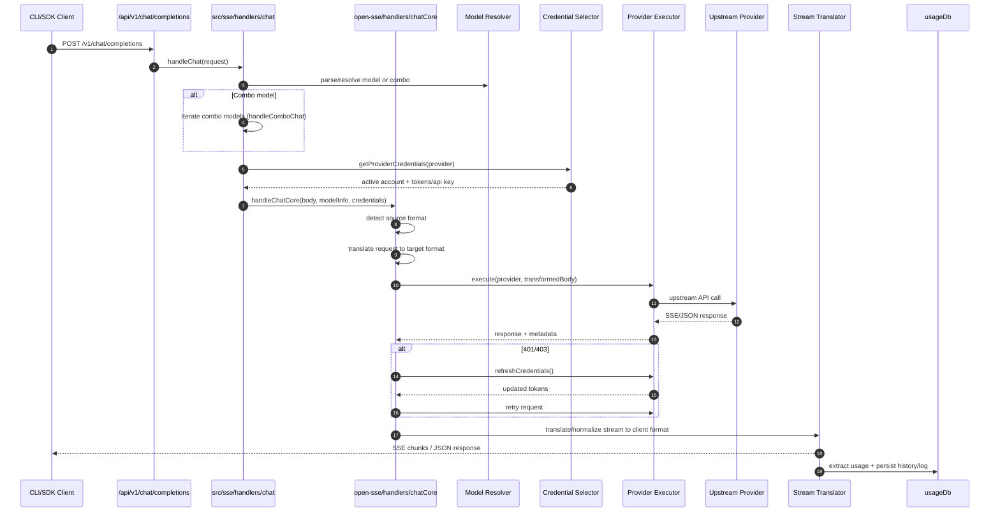
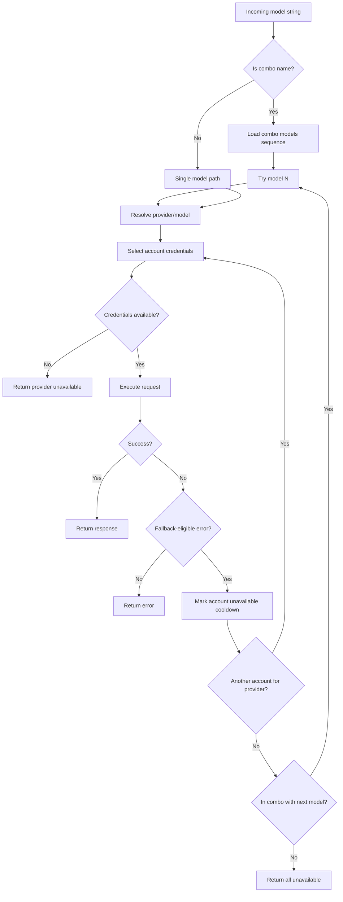
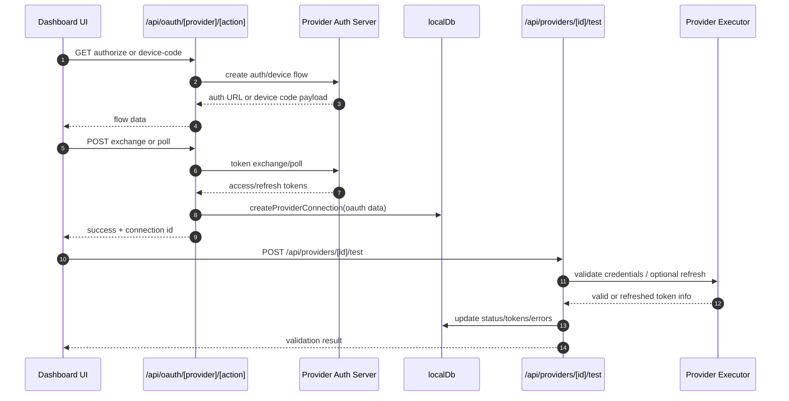
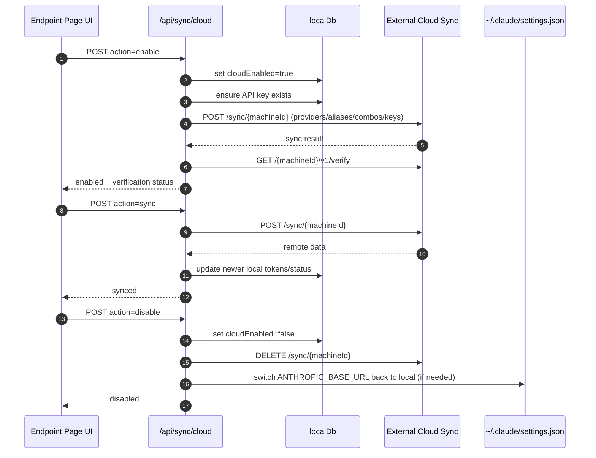
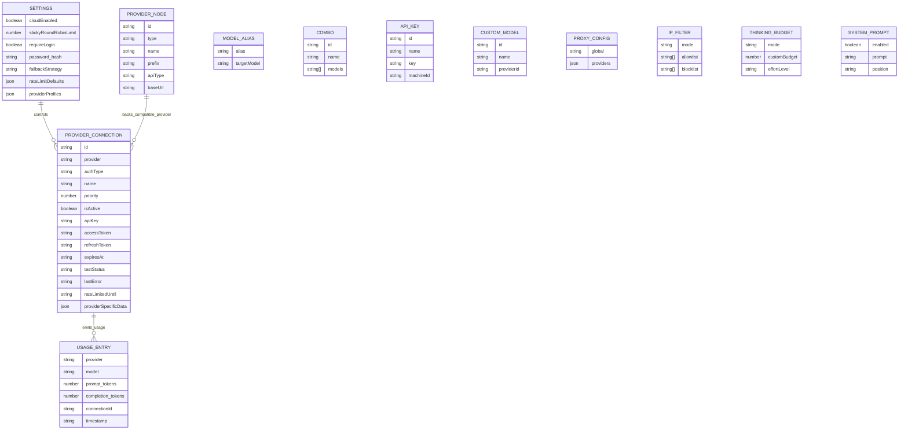
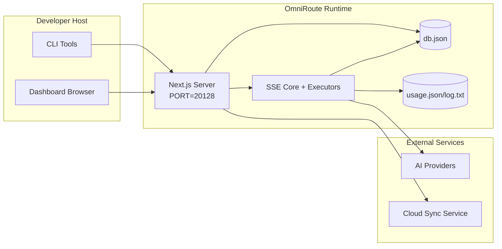

# العمارة OmniRoute

🌐 **Languages:** 🇺🇸 [English](../../ARCHITECTURE.md) | 🇧🇷 [Português (Brasil)](../pt-BR/ARCHITECTURE.md) | 🇪🇸 [Español](../es/ARCHITECTURE.md) | 🇫🇷 [Français](../fr/ARCHITECTURE.md) | 🇮🇹 [Italiano](../it/ARCHITECTURE.md) | 🇷🇺 [Русский](../ru/ARCHITECTURE.md) | 🇨🇳 [中文 (简体)](../zh-CN/ARCHITECTURE.md) | 🇩🇪 [Deutsch](../de/ARCHITECTURE.md) | 🇮🇳 [हिन्दी](../in/ARCHITECTURE.md) | 🇹🇭 [ไทย](../th/ARCHITECTURE.md) | 🇺🇦 [Українська](../uk-UA/ARCHITECTURE.md) | 🇸🇦 [العربية](../ar/ARCHITECTURE.md) | 🇯🇵 [日本語](../ja/ARCHITECTURE.md) | 🇻🇳 [Tiếng Việt](../vi/ARCHITECTURE.md) | 🇧🇬 [Български](../bg/ARCHITECTURE.md) | 🇩🇰 [Dansk](../da/ARCHITECTURE.md) | 🇫🇮 [Suomi](../fi/ARCHITECTURE.md) | 🇮🇱 [עברית](../he/ARCHITECTURE.md) | 🇭🇺 [Magyar](../hu/ARCHITECTURE.md) | 🇮🇩 [Bahasa Indonesia](../id/ARCHITECTURE.md) | 🇰🇷 [한국어](../ko/ARCHITECTURE.md) | 🇲🇾 [Bahasa Melayu](../ms/ARCHITECTURE.md) | 🇳🇱 [Nederlands](../nl/ARCHITECTURE.md) | 🇳🇴 [Norsk](../no/ARCHITECTURE.md) | 🇵🇹 [Português (Portugal)](../pt/ARCHITECTURE.md) | 🇷🇴 [Română](../ro/ARCHITECTURE.md) | 🇵🇱 [Polski](../pl/ARCHITECTURE.md) | 🇸🇰 [Slovenčina](../sk/ARCHITECTURE.md) | 🇸🇪 [Svenska](../sv/ARCHITECTURE.md) | 🇵🇭 [Filipino](../phi/ARCHITECTURE.md)

_آخر تحديث: 2026-02-18_

## ملخص تنفيذي

OmniRoute عبارة عن بوابة توجيه محلية تعمل بالذكاء الاصطناعي ولوحة معلومات مبنية على Next.js.
فهو يوفر نقطة نهاية واحدة متوافقة مع OpenAI (`/v1/*`) ويوجه حركة المرور عبر العديد من موفري الخدمات الأولية مع الترجمة والاحتياط وتحديث الرمز المميز وتتبع الاستخدام.

القدرات الأساسية:

- سطح API متوافق مع OpenAI لـ CLI/الأدوات (28 مزودًا)
- ترجمة الطلب/الاستجابة عبر تنسيقات الموفر
- نموذج احتياطي التحرير والسرد (تسلسل متعدد النماذج)
- احتياطي على مستوى الحساب (حسابات متعددة لكل مزود)
- إدارة اتصال موفر OAuth + API-key
- إنشاء التضمين عبر `/v1/embeddings` (6 موفري خدمات، 9 نماذج)
- إنشاء الصور عبر `/v1/images/generations` (4 مقدمي خدمات، 9 نماذج)
- فكر في تحليل العلامات (`<think>...</think>`) لنماذج الاستدلال
- تعقيم الاستجابة للتوافق الصارم مع OpenAI SDK
- تطبيع الدور (المطور → النظام، النظام → المستخدم) للتوافق بين الموفرين
- تحويل الإخراج المنظم (json_schema → Gemini ResponseSchema)
- الثبات المحلي لمقدمي الخدمات والمفاتيح والأسماء المستعارة والمجموعات والإعدادات والتسعير
- تتبع الاستخدام/التكلفة وتسجيل الطلب
- مزامنة سحابية اختيارية لمزامنة الأجهزة/الحالة المتعددة
- القائمة المسموح بها/القائمة المحظورة لـ IP للتحكم في الوصول إلى واجهة برمجة التطبيقات
- التفكير في إدارة الميزانية (العبور / التلقائي / المخصص / التكيفي)
- الحقن الفوري للنظام العالمي
- تتبع الجلسة وأخذ البصمات
- تحديد المعدل المحسن لكل حساب مع الملفات الشخصية الخاصة بالمزود
- نمط قاطع الدائرة لمرونة المزود
- حماية القطيع ضد الرعد مع قفل Mutex
- ذاكرة التخزين المؤقت لإلغاء البيانات المكررة للطلب المستندة إلى التوقيع
- طبقة المجال: توفر النموذج، وقواعد التكلفة، والسياسة الاحتياطية، وسياسة الإغلاق
- استمرارية حالة المجال (ذاكرة التخزين المؤقت للكتابة في SQLite للاحتياطيات والميزانيات وعمليات الإغلاق وقواطع الدائرة)
- محرك السياسة لتقييم الطلب المركزي (التأمين → الميزانية → الاحتياطي)
- طلب القياس عن بعد مع تجميع الكمون p50/p95/p99
- معرف الارتباط (X-Request-Id) للتتبع الشامل
- تسجيل تدقيق الامتثال مع إلغاء الاشتراك لكل مفتاح API
- إطار تقييمي لضمان جودة LLM
- لوحة تحكم واجهة المستخدم المرنة مع حالة قاطع الدائرة في الوقت الفعلي
- موفرو OAuth المعياريون (12 وحدة فردية ضمن `src/lib/oauth/providers/`)

نموذج وقت التشغيل الأساسي:

- تقوم مسارات تطبيق Next.js ضمن `src/app/api/*` بتنفيذ كل من واجهات برمجة تطبيقات لوحة المعلومات وواجهات برمجة تطبيقات التوافق
- نواة توجيه/SSE مشتركة في `src/sse/*` + `open-sse/*` تتعامل مع تنفيذ الموفر والترجمة والتدفق والرجوع والاستخدام

## النطاق والحدود

### في النطاق

- وقت تشغيل البوابة المحلية
- واجهات برمجة التطبيقات لإدارة لوحة المعلومات
- مصادقة الموفر وتحديث الرمز المميز
- طلب الترجمة وتدفق SSE
- الحالة المحلية + استمرارية الاستخدام
- تنسيق مزامنة سحابية اختيارية

### خارج النطاق

- تنفيذ الخدمة السحابية خلف `NEXT_PUBLIC_CLOUD_URL`
- مزود مستوى جيش تحرير السودان/مستوى التحكم خارج العملية المحلية
- ثنائيات CLI الخارجية نفسها (Claude CLI، Codex CLI، وما إلى ذلك)

## سياق النظام عالي المستوى



## مكونات وقت التشغيل الأساسية

## 1) واجهة برمجة التطبيقات وطبقة التوجيه (مسارات تطبيق Next.js)

الدلائل الرئيسية:

- `src/app/api/v1/*` و`src/app/api/v1beta/*` لواجهات برمجة تطبيقات التوافق
- `src/app/api/*` لواجهات برمجة التطبيقات للإدارة/التكوين
- تتم إعادة الكتابة التالية في الخريطة `next.config.mjs` من `/v1/*` إلى `/api/v1/*`

طرق التوافق الهامة:

- `src/app/api/v1/chat/completions/route.ts`
- `src/app/api/v1/messages/route.ts`
- `src/app/api/v1/responses/route.ts`
- `src/app/api/v1/models/route.ts` — يتضمن نماذج مخصصة مع `custom: true`
- `src/app/api/v1/embeddings/route.ts` — إنشاء التضمين (6 موفري)
- `src/app/api/v1/images/generations/route.ts` — إنشاء الصور (أكثر من 4 موفري خدمة، بما في ذلك Antigravity/Nebius)
- `src/app/api/v1/messages/count_tokens/route.ts`
- `src/app/api/v1/providers/[provider]/chat/completions/route.ts` — دردشة مخصصة لكل مزود
- `src/app/api/v1/providers/[provider]/embeddings/route.ts` — عمليات التضمين المخصصة لكل مزود
- `src/app/api/v1/providers/[provider]/images/generations/route.ts` — صور مخصصة لكل مزود
- `src/app/api/v1beta/models/route.ts`
- `src/app/api/v1beta/models/[...path]/route.ts`

مجالات الإدارة:

- المصادقة/الإعدادات: `src/app/api/auth/*`، `src/app/api/settings/*`
- مقدمو الخدمة/الاتصالات: `src/app/api/providers*`
- عقد الموفر: `src/app/api/provider-nodes*`
- النماذج المخصصة: `src/app/api/provider-models` (GET/POST/DELETE)
- كتالوج النماذج: `src/app/api/models/catalog` (GET)
- تكوين الوكيل: `src/app/api/settings/proxy` (GET/PUT/DELETE) + `src/app/api/settings/proxy/test` (POST)
- OAuth: `src/app/api/oauth/*`
- المفاتيح/الأسماء المستعارة/المجموعات/التسعير: `src/app/api/keys*`، `src/app/api/models/alias`، `src/app/api/combos*`، `src/app/api/pricing`
- الاستخدام: `src/app/api/usage/*`
- المزامنة/السحابة: `src/app/api/sync/*`، `src/app/api/cloud/*`
- مساعدي أدوات CLI: `src/app/api/cli-tools/*`
- مرشح IP: `src/app/api/settings/ip-filter` (GET/PUT)
- ميزانية التفكير: `src/app/api/settings/thinking-budget` (GET/PUT)
- موجه النظام: `src/app/api/settings/system-prompt` (GET/PUT)
- الجلسات: `src/app/api/sessions` (GET)
- حدود الأسعار: `src/app/api/rate-limits` (GET)
- المرونة: `src/app/api/resilience` (GET/PATCH) - ملفات تعريف الموفر، قاطع الدائرة، حالة حد المعدل
- إعادة ضبط المرونة: `src/app/api/resilience/reset` (POST) — إعادة ضبط الفواصل + فترات التهدئة
- إحصائيات ذاكرة التخزين المؤقت: `src/app/api/cache/stats` (الحصول على/الحذف)
- توفر النموذج: `src/app/api/models/availability` (GET/POST)
- القياس عن بعد: `src/app/api/telemetry/summary` (GET)
- الميزانية: `src/app/api/usage/budget` (GET/POST)
- السلاسل الاحتياطية: `src/app/api/fallback/chains` (GET/POST/DELETE)
- تدقيق الامتثال: `src/app/api/compliance/audit-log` (GET)
- التقييمات: `src/app/api/evals` (GET/POST)، `src/app/api/evals/[suiteId]` (GET)
- السياسات: `src/app/api/policies` (GET/POST)

## 2) SSE + جوهر الترجمة

وحدات التدفق الرئيسية:

- الإدخال: `src/sse/handlers/chat.ts`
- التنسيق الأساسي: `open-sse/handlers/chatCore.ts`
- محولات تنفيذ الموفر: `open-sse/executors/*`
- اكتشاف التنسيق/تكوين الموفر: `open-sse/services/provider.ts`
- تحليل/حل النموذج: `src/sse/services/model.ts`، `open-sse/services/model.ts`
- المنطق الاحتياطي للحساب: `open-sse/services/accountFallback.ts`
- سجل الترجمة: `open-sse/translator/index.ts`
- تحويلات الدفق: `open-sse/utils/stream.ts`، `open-sse/utils/streamHandler.ts`
- استخراج/تسوية الاستخدام: `open-sse/utils/usageTracking.ts`
- محلل العلامات: `open-sse/utils/thinkTagParser.ts`
- معالج التضمين: `open-sse/handlers/embeddings.ts`
- تسجيل موفر التضمين: `open-sse/config/embeddingRegistry.ts`
- معالج إنشاء الصور: `open-sse/handlers/imageGeneration.ts`
- سجل موفر الصور: `open-sse/config/imageRegistry.ts`
- تعقيم الاستجابة: `open-sse/handlers/responseSanitizer.ts`
- تطبيع الدور: `open-sse/services/roleNormalizer.ts`

الخدمات (منطق الأعمال):

- اختيار الحساب/تسجيل النقاط: `open-sse/services/accountSelector.ts`
- إدارة دورة حياة السياق: `open-sse/services/contextManager.ts`
- فرض عامل تصفية IP: `open-sse/services/ipFilter.ts`
- تتبع الجلسة: `open-sse/services/sessionManager.ts`
- طلب إلغاء البيانات المكررة: `open-sse/services/signatureCache.ts`
- الحقن الفوري للنظام: `open-sse/services/systemPrompt.ts`
- إدارة ميزانية التفكير: `open-sse/services/thinkingBudget.ts`
- توجيه نموذج حرف البدل: `open-sse/services/wildcardRouter.ts`
- إدارة حدود السعر: `open-sse/services/rateLimitManager.ts`
- قاطع الدائرة: `open-sse/services/circuitBreaker.ts`

وحدات طبقة المجال:

- توفر النموذج: `src/lib/domain/modelAvailability.ts`
- قواعد/ميزانيات التكلفة: `src/lib/domain/costRules.ts`
- السياسة الاحتياطية: `src/lib/domain/fallbackPolicy.ts`
- محلل التحرير والسرد: `src/lib/domain/comboResolver.ts`
- سياسة التأمين: `src/lib/domain/lockoutPolicy.ts`
- محرك السياسة: `src/domain/policyEngine.ts` — الإغلاق المركزي ← الميزانية ← التقييم الاحتياطي
- كتالوج رموز الأخطاء: `src/lib/domain/errorCodes.ts`
- معرف الطلب: `src/lib/domain/requestId.ts`
- مهلة الجلب: `src/lib/domain/fetchTimeout.ts`
- طلب القياس عن بعد: `src/lib/domain/requestTelemetry.ts`
- الامتثال/التدقيق: `src/lib/domain/compliance/index.ts`
- عداء التقييم: `src/lib/domain/evalRunner.ts`
- استمرارية حالة المجال: `src/lib/db/domainState.ts` — SQLite CRUD للسلاسل الاحتياطية، والميزانيات، وتاريخ التكلفة، وحالة الإغلاق، وقواطع الدائرة

وحدات موفر OAuth (12 ملفًا فرديًا ضمن `src/lib/oauth/providers/`):

- فهرس التسجيل: `src/lib/oauth/providers/index.ts`
- مقدمو الخدمات الأفراد: `claude.ts`، `codex.ts`، `gemini.ts`، `antigravity.ts`، `iflow.ts`، `qwen.ts`، `kimi-coding.ts`، `github.ts`، `kiro.ts`، `cursor.ts`، `kilocode.ts`، `cline.ts`
- الغلاف الرقيق: `src/lib/oauth/providers.ts` — إعادة التصدير من الوحدات الفردية

## 3) طبقة الثبات

قاعدة بيانات الحالة الأساسية:

- `src/lib/localDb.ts`
- الملف: `${DATA_DIR}/db.json` (أو `$XDG_CONFIG_HOME/omniroute/db.json` عند التعيين، وإلا `~/.omniroute/db.json`)
- الكيانات:providerConnections، وproviderNodes، وmodelAliases، والمجموعات، وapiKeys، والإعدادات، والتسعير، **customModels**، **proxyConfig**، **ipFilter**، **thinkingBudget**، **systemPrompt**

قاعدة بيانات الاستخدام:

- `src/lib/usageDb.ts`
- الملفات: `${DATA_DIR}/usage.json`، `${DATA_DIR}/log.txt`، `${DATA_DIR}/call_logs/`
- يتبع نفس سياسة الدليل الأساسي مثل `localDb` (`DATA_DIR`، ثم `XDG_CONFIG_HOME/omniroute` عند التعيين)
- مقسمة إلى وحدات فرعية مركزة: `migrations.ts`، `usageHistory.ts`، `costCalculator.ts`، `usageStats.ts`، `callLogs.ts`

قاعدة بيانات حالة المجال (SQLite):

- `src/lib/db/domainState.ts` — عمليات CRUD لحالة المجال
- الجداول (التي تم إنشاؤها في `src/lib/db/core.ts`): `domain_fallback_chains`، `domain_budgets`، `domain_cost_history`، `domain_lockout_state`، `domain_circuit_breakers`
- نمط ذاكرة التخزين المؤقت للكتابة: تعد الخرائط الموجودة في الذاكرة موثوقة في وقت التشغيل؛ تتم كتابة الطفرات بشكل متزامن إلى SQLite؛ تتم استعادة الحالة من قاعدة البيانات عند البداية الباردة

## 4) المصادقة + الأسطح الأمنية

- مصادقة ملف تعريف الارتباط للوحة المعلومات: `src/proxy.ts`، `src/app/api/auth/login/route.ts`
- إنشاء/التحقق من مفتاح واجهة برمجة التطبيقات: `src/shared/utils/apiKey.ts`
- استمرت أسرار الموفر في إدخالات `providerConnections`
- دعم الوكيل الصادر عبر `open-sse/utils/proxyFetch.ts` (env vars) و`open-sse/utils/networkProxy.ts` (قابل للتكوين لكل موفر أو عالمي)

## 5) المزامنة السحابية

- الحرف الأول للمجدول: `src/lib/initCloudSync.ts`، `src/shared/services/initializeCloudSync.ts`
- المهمة الدورية: `src/shared/services/cloudSyncScheduler.ts`
- مسار التحكم: `src/app/api/sync/cloud/route.ts`

## دورة حياة الطلب (`/v1/chat/completions`)



## التحرير والسرد + التدفق الاحتياطي للحساب



يتم اتخاذ القرارات الاحتياطية بواسطة `open-sse/services/accountFallback.ts` باستخدام رموز الحالة والاستدلال على رسائل الخطأ.

## دورة حياة OAuth Onboarding وتحديث الرمز المميز



يتم تنفيذ التحديث أثناء حركة المرور المباشرة داخل `open-sse/handlers/chatCore.ts` عبر المنفذ `refreshCredentials()`.

## دورة حياة المزامنة السحابية (تمكين / مزامنة / تعطيل)



يتم تشغيل المزامنة الدورية بواسطة `CloudSyncScheduler` عند تمكين السحابة.

## نموذج البيانات وخريطة التخزين



ملفات التخزين المادية:

- الحالة الرئيسية: `${DATA_DIR}/db.json` (أو `$XDG_CONFIG_HOME/omniroute/db.json` عند التعيين، وإلا `~/.omniroute/db.json`)
- إحصائيات الاستخدام: `${DATA_DIR}/usage.json`
- خطوط سجل الطلب: `${DATA_DIR}/log.txt`
- جلسات تصحيح أخطاء المترجم/الطلب الاختيارية: `<repo>/logs/...`

## طبولوجيا النشر



## تعيين الوحدة (القرار الحاسم)

### وحدات المسار وواجهة برمجة التطبيقات

- `src/app/api/v1/*`، `src/app/api/v1beta/*`: واجهات برمجة تطبيقات التوافق
- `src/app/api/v1/providers/[provider]/*`: مسارات مخصصة لكل مزود (الدردشة والتضمين والصور)
- `src/app/api/providers*`: موفر CRUD والتحقق من الصحة والاختبار
- `src/app/api/provider-nodes*`: إدارة العقدة المتوافقة المخصصة
- `src/app/api/provider-models`: إدارة النماذج المخصصة (CRUD)
- `src/app/api/models/catalog`: واجهة برمجة تطبيقات كتالوج النموذج الكامل (جميع الأنواع مجمعة حسب الموفر)
- `src/app/api/oauth/*`: تدفقات OAuth/رمز الجهاز
- `src/app/api/keys*`: دورة حياة مفتاح واجهة برمجة التطبيقات المحلية
- `src/app/api/models/alias`: إدارة الاسم المستعار
- `src/app/api/combos*`: إدارة التحرير والسرد الاحتياطية
- `src/app/api/pricing`: تجاوزات التسعير لحساب التكلفة
- `src/app/api/settings/proxy`: تكوين الوكيل (GET/PUT/DELETE)
- `src/app/api/settings/proxy/test`: اختبار اتصال الوكيل الصادر (POST)
- `src/app/api/usage/*`: واجهات برمجة تطبيقات الاستخدام والسجلات
- `src/app/api/sync/*` + `src/app/api/cloud/*`: المزامنة السحابية والمساعدون الذين يواجهون السحابة
- `src/app/api/cli-tools/*`: كاتب/أداة فحص تكوين CLI المحلية
- `src/app/api/settings/ip-filter`: قائمة IP المسموح بها/القائمة المحظورة (GET/PUT)
- `src/app/api/settings/thinking-budget`: تكوين ميزانية الرمز المميز (GET/PUT)
- `src/app/api/settings/system-prompt`: موجه النظام العالمي (GET/PUT)
- `src/app/api/sessions`: قائمة الجلسة النشطة (GET)
- `src/app/api/rate-limits`: حالة حد السعر لكل حساب (GET)

### التوجيه والتنفيذ الأساسي

- `src/sse/handlers/chat.ts`: تحليل الطلب، ومعالجة التحرير والسرد، وحلقة اختيار الحساب
- `open-sse/handlers/chatCore.ts`: الترجمة، إرسال المنفذ، معالجة إعادة المحاولة/التحديث، إعداد الدفق
- `open-sse/executors/*`: سلوك الشبكة والتنسيق الخاص بالموفر

### سجل الترجمة ومحولات التنسيق

- `open-sse/translator/index.ts`: تسجيل المترجم وتنسيقه
- طلب المترجمين: `open-sse/translator/request/*`
- مترجمو الرد: `open-sse/translator/response/*`
- ثوابت التنسيق: `open-sse/translator/formats.ts`

### المثابرة

- `src/lib/localDb.ts`: التكوين/الحالة المستمرة
- `src/lib/usageDb.ts`: سجل الاستخدام وسجلات الطلبات المتجددة

## تغطية منفذي الخدمة (نمط الإستراتيجية)

كل مزود لديه منفذ متخصص يمتد `BaseExecutor` (في `open-sse/executors/base.ts`)، والذي يوفر بناء عنوان URL، وإنشاء الرأس، وإعادة المحاولة مع التراجع الأسي، وخطافات تحديث بيانات الاعتماد، وطريقة التنسيق `execute()`.

| المنفذ                | المزود (المقدمون)                                                                                                                                            | التعامل الخاص                                                          |
| --------------------- | ------------------------------------------------------------------------------------------------------------------------------------------------------------ | ---------------------------------------------------------------------- |
| `DefaultExecutor`     | OpenAI، Claude، Gemini، Qwen، iFlow، OpenRouter، GLM، Kimi، MiniMax، DeepSeek، Groq، xAI، Mistral، Perplexity، Together، Fireworks، Cerebras، Cohere، NVIDIA | تكوين عنوان URL/الرأس الديناميكي لكل مزود                              |
| `AntigravityExecutor` | جوجل مكافحة الجاذبية                                                                                                                                         | معرفات المشروع/الجلسة المخصصة، إعادة المحاولة بعد التحليل              |
| `CodexExecutor`       | OpenAI Codex                                                                                                                                                 | يحقن تعليمات النظام، ويفرض جهدًا منطقيًا                               |
| `CursorExecutor`      | بيئة تطوير متكاملة للمؤشر                                                                                                                                    | بروتوكول ConnectRPC، تشفير Protobuf، طلب التوقيع عبر المجموع الاختباري |
| `GithubExecutor`      | جيثب مساعد الطيار                                                                                                                                            | تحديث الرمز المميز لـ Copilot، ورؤوس محاكاة VSCode                     |
| `KiroExecutor`        | AWS CodeWhisperer/كيرو                                                                                                                                       | تنسيق AWS EventStream الثنائي → تحويل SSE                              |
| `GeminiCLIExecutor`   | الجوزاء CLI                                                                                                                                                  | دورة تحديث رمز OAuth المميز لـ Google                                  |

يستخدم جميع الموفرين الآخرين (بما في ذلك العقد المتوافقة المخصصة) `DefaultExecutor`.

## مصفوفة توافق الموفر

| مقدم                                | تنسيق            | مصادقة                      | تيار            | غير دفق | تحديث الرمز المميز | واجهة برمجة تطبيقات الاستخدام |
| ----------------------------------- | ---------------- | --------------------------- | --------------- | ------- | ------------------ | ----------------------------- |
| كلود                                | كلود             | مفتاح API / OAuth           | ✅              | ✅      | ✅                 | ⚠️ المشرف فقط                 |
| الجوزاء                             | الجوزاء          | مفتاح API / OAuth           | ✅              | ✅      | ✅                 | ⚠️ وحدة التحكم السحابية       |
| الجوزاء CLI                         | الجوزاء-cli      | أووث                        | ✅              | ✅      | ✅                 | ⚠️ وحدة التحكم السحابية       |
| مكافحة الجاذبية                     | ضد الجاذبية      | أووث                        | ✅              | ✅      | ✅                 | ✅ الحصة الكاملة API          |
| أوبن آي                             | أوبيناي          | مفتاح واجهة برمجة التطبيقات | ✅              | ✅      | ❌                 | ❌                            |
| الدستور الغذائي                     | openai-responses | أووث                        | ✅ مجبور        | ❌      | ✅                 | ✅ حدود المعدل                |
| جيثب مساعد الطيار                   | أوبيناي          | OAuth + رمز مساعد الطيار    | ✅              | ✅      | ✅                 | ✅ لقطات الحصص                |
| المؤشر                              | المؤشر           | المجموع الاختباري المخصص    | ✅              | ✅      | ❌                 | ❌                            |
| كيرو                                | كيرو             | AWS SSO OIDC                | ✅(ايفنت ستريم) | ❌      | ✅                 | ✅ حدود الاستخدام             |
| كوين                                | أوبيناي          | أووث                        | ✅              | ✅      | ✅                 | ⚠️ حسب الطلب                  |
| اي فلو                              | أوبيناي          | OAuth (أساسي)               | ✅              | ✅      | ✅                 | ⚠️ حسب الطلب                  |
| اوبن راوتر                          | أوبيناي          | مفتاح واجهة برمجة التطبيقات | ✅              | ✅      | ❌                 | ❌                            |
| جي إل إم/كيمي/ميني ماكس             | كلود             | مفتاح واجهة برمجة التطبيقات | ✅              | ✅      | ❌                 | ❌                            |
| ديب سيك                             | أوبيناي          | مفتاح واجهة برمجة التطبيقات | ✅              | ✅      | ❌                 | ❌                            |
| جروك                                | أوبيناي          | مفتاح واجهة برمجة التطبيقات | ✅              | ✅      | ❌                 | ❌                            |
| xAI (جروك)                          | أوبيناي          | مفتاح واجهة برمجة التطبيقات | ✅              | ✅      | ❌                 | ❌                            |
| ميسترال                             | أوبيناي          | مفتاح واجهة برمجة التطبيقات | ✅              | ✅      | ❌                 | ❌                            |
| الحيرة                              | أوبيناي          | مفتاح واجهة برمجة التطبيقات | ✅              | ✅      | ❌                 | ❌                            |
| معا منظمة العفو الدولية             | أوبيناي          | مفتاح واجهة برمجة التطبيقات | ✅              | ✅      | ❌                 | ❌                            |
| الألعاب النارية منظمة العفو الدولية | أوبيناي          | مفتاح واجهة برمجة التطبيقات | ✅              | ✅      | ❌                 | ❌                            |
| المخيخ                              | أوبيناي          | مفتاح واجهة برمجة التطبيقات | ✅              | ✅      | ❌                 | ❌                            |
| كوهير                               | أوبيناي          | مفتاح واجهة برمجة التطبيقات | ✅              | ✅      | ❌                 | ❌                            |
| نفيديا نيم                          | أوبيناي          | مفتاح واجهة برمجة التطبيقات | ✅              | ✅      | ❌                 | ❌                            |

## تنسيق تغطية الترجمة

تتضمن تنسيقات المصدر المكتشفة ما يلي:

- `openai`
- `openai-responses`
- `claude`
- `gemini`

تتضمن التنسيقات المستهدفة ما يلي:

- دردشة/ردود OpenAI
- كلود
- الجوزاء/الجوزاء-CLI/الظرف المضاد للجاذبية
- كيرو
- المؤشر

تستخدم الترجمات **OpenAI كتنسيق مركزي** — تمر جميع التحويلات عبر OpenAI كتنسيق وسيط:

```
Source Format → OpenAI (hub) → Target Format
```

يتم تحديد الترجمات ديناميكيًا استنادًا إلى شكل حمولة المصدر والتنسيق المستهدف للموفر.

طبقات معالجة إضافية في مسار الترجمة:

- **تطهير الاستجابة** — يزيل الحقول غير القياسية من استجابات تنسيق OpenAI (سواء المتدفقة أو غير المتدفقة) لضمان الامتثال الصارم لـ SDK
- **تطبيع الدور** — تحويل `developer` → `system` للأهداف غير التابعة لـ OpenAI؛ يدمج `system` → `user` للنماذج التي ترفض دور النظام (GLM، ERNIE)
- **فكر في استخراج العلامات** — يوزع كتل `<think>...</think>` من المحتوى إلى حقل `reasoning_content`
- **الإخراج المنظم** — يحول OpenAI `response_format.json_schema` إلى `responseMimeType` + `responseSchema` الخاص بـ Gemini

## نقاط نهاية واجهة برمجة التطبيقات المدعومة

| نقطة النهاية                                       | تنسيق              | معالج                                                                     |
| -------------------------------------------------- | ------------------ | ------------------------------------------------------------------------- |
| `POST /v1/chat/completions`                        | دردشة OpenAI       | `src/sse/handlers/chat.ts`                                                |
| `POST /v1/messages`                                | رسائل كلود         | نفس المعالج (تم اكتشافه تلقائيًا)                                         |
| `POST /v1/responses`                               | ردود OpenAI        | `open-sse/handlers/responsesHandler.ts`                                   |
| `POST /v1/embeddings`                              | تضمينات OpenAI     | `open-sse/handlers/embeddings.ts`                                         |
| `GET /v1/embeddings`                               | قائمة النماذج      | طريق API                                                                  |
| `POST /v1/images/generations`                      | صور OpenAI         | `open-sse/handlers/imageGeneration.ts`                                    |
| `GET /v1/images/generations`                       | قائمة النماذج      | طريق API                                                                  |
| `POST /v1/providers/{provider}/chat/completions`   | دردشة OpenAI       | مخصص لكل مزود مع التحقق من صحة النموذج                                    |
| `POST /v1/providers/{provider}/embeddings`         | تضمينات OpenAI     | مخصص لكل مزود مع التحقق من صحة النموذج                                    |
| `POST /v1/providers/{provider}/images/generations` | صور OpenAI         | مخصص لكل مزود مع التحقق من صحة النموذج                                    |
| `POST /v1/messages/count_tokens`                   | عدد كلود توكن      | طريق API                                                                  |
| `GET /v1/models`                                   | قائمة نماذج OpenAI | مسار واجهة برمجة التطبيقات (الدردشة + التضمين + الصورة + النماذج المخصصة) |
| `GET /api/models/catalog`                          | كتالوج             | جميع النماذج مجمعة حسب الموفر + النوع                                     |
| `POST /v1beta/models/*:streamGenerateContent`      | مولود برج الجوزاء  | طريق API                                                                  |
| `GET/PUT/DELETE /api/settings/proxy`               | تكوين الوكيل       | تكوين وكيل الشبكة                                                         |
| `POST /api/settings/proxy/test`                    | اتصال الوكيل       | نقطة نهاية اختبار صحة الوكيل/الاتصال                                      |
| `GET/POST/DELETE /api/provider-models`             | نماذج مخصصة        | إدارة النماذج المخصصة لكل مزود                                            |

## تجاوز المعالج

يعترض معالج التجاوز (`open-sse/utils/bypassHandler.ts`) طلبات "الرمي" المعروفة من Claude CLI - أصوات التمهيد، واستخراج العناوين، وعدد الرموز المميزة - ويعيد **استجابة زائفة** دون استهلاك الرموز المميزة للموفر الرئيسي. يتم تشغيل هذا فقط عندما يحتوي `User-Agent` على `claude-cli`.

## طلب خط أنابيب المسجل

يوفر مسجل الطلب (`open-sse/utils/requestLogger.ts`) مسارًا لتسجيل تصحيح الأخطاء مكون من 7 مراحل، معطل افتراضيًا، وممكن عبر `ENABLE_REQUEST_LOGS=true`:

```
1_req_client.json → 2_req_source.json → 3_req_openai.json → 4_req_target.json
→ 5_res_provider.txt → 6_res_openai.txt → 7_res_client.txt
```

تتم كتابة الملفات إلى `<repo>/logs/<session>/` لكل جلسة طلب.

## أوضاع الفشل والمرونة

## 1) توفر الحساب/المزود

- فترة تباطؤ حساب الموفر عند حدوث أخطاء عابرة/معدل/مصادقة
- احتياطي الحساب قبل فشل الطلب
- نموذج التحرير والسرد الاحتياطي عند استنفاد مسار النموذج/المزود الحالي

## 2) انتهاء صلاحية الرمز المميز

- الفحص المسبق والتحديث مع إعادة المحاولة لموفري الخدمة القابلين للتحديث
- 401/403 إعادة المحاولة بعد محاولة التحديث في المسار الأساسي

## 3) سلامة الدفق

- وحدة تحكم تيار قطع الاتصال
- دفق الترجمة مع تدفق نهاية الدفق ومعالجة `[DONE]`
- احتياطي تقدير الاستخدام عندما تكون البيانات الوصفية لاستخدام الموفر مفقودة

## 4) تدهور المزامنة السحابية

- ظهرت أخطاء المزامنة ولكن يستمر وقت التشغيل المحلي
- يحتوي المجدول على منطق قادر على إعادة المحاولة، ولكن التنفيذ الدوري يستدعي حاليًا مزامنة المحاولة الواحدة بشكل افتراضي

## 5) سلامة البيانات

- ترحيل/إصلاح شكل قاعدة البيانات للمفاتيح المفقودة
- ضمانات إعادة تعيين JSON الفاسدة لـ localDb وuseDb

## إمكانية الملاحظة والإشارات التشغيلية

مصادر رؤية وقت التشغيل:

- سجلات وحدة التحكم من `src/sse/utils/logger.ts`
- مجاميع الاستخدام لكل طلب في `usage.json`
- سجل حالة الطلب النصي في `log.txt`
- سجلات الطلب/الترجمة العميقة الاختيارية ضمن `logs/` عندما `ENABLE_REQUEST_LOGS=true`
- نقاط نهاية استخدام لوحة المعلومات (`/api/usage/*`) لاستهلاك واجهة المستخدم

## الحدود الحساسة للأمن

- سر JWT (`JWT_SECRET`) يؤمن التحقق/التوقيع على ملف تعريف الارتباط لجلسة لوحة المعلومات
- يجب تجاوز الاحتياطي الأولي لكلمة المرور (`INITIAL_PASSWORD`، الافتراضي `123456`) في عمليات النشر الحقيقية
- سر HMAC لمفتاح API (`API_KEY_SECRET`) يؤمن تنسيق مفتاح API المحلي الذي تم إنشاؤه
- تظل أسرار الموفر (مفاتيح/رموز واجهة برمجة التطبيقات) موجودة في قاعدة البيانات المحلية ويجب حمايتها على مستوى نظام الملفات
- تعتمد نقاط نهاية المزامنة السحابية على مصادقة مفتاح API + دلالات معرف الجهاز

## مصفوفة البيئة ووقت التشغيل

متغيرات البيئة المستخدمة بشكل نشط بواسطة التعليمات البرمجية:

- التطبيق/المصادقة: `JWT_SECRET`، `INITIAL_PASSWORD`
- التخزين: `DATA_DIR`
- سلوك العقدة المتوافقة: `ALLOW_MULTI_CONNECTIONS_PER_COMPAT_NODE`
- تجاوز قاعدة التخزين الاختيارية (Linux/macOS عند إلغاء تعيين `DATA_DIR`): `XDG_CONFIG_HOME`
- التجزئة الأمنية: `API_KEY_SECRET`، `MACHINE_ID_SALT`
- التسجيل: `ENABLE_REQUEST_LOGS`
- عنوان URL للمزامنة/السحابة: `NEXT_PUBLIC_BASE_URL`، `NEXT_PUBLIC_CLOUD_URL`
- الوكيل الصادر: `HTTP_PROXY`، `HTTPS_PROXY`، `ALL_PROXY`، `NO_PROXY` ومتغيرات الأحرف الصغيرة
- علامات ميزات SOCKS5: `ENABLE_SOCKS5_PROXY`، `NEXT_PUBLIC_ENABLE_SOCKS5_PROXY`
- مساعدو النظام الأساسي/وقت التشغيل (ليس التكوين الخاص بالتطبيق): `APPDATA`، `NODE_ENV`، `PORT`، `HOSTNAME`

## الملاحظات المعمارية المعروفة

1. يتشارك `usageDb` و`localDb` الآن نفس سياسة الدليل الأساسي (`DATA_DIR` -> `XDG_CONFIG_HOME/omniroute` -> `~/.omniroute`) مع ترحيل الملفات القديمة.
2. يقوم `/api/v1/route.ts` بإرجاع قائمة نماذج ثابتة وهو ليس مصدر النماذج الرئيسي الذي يستخدمه `/v1/models`.
3. يقوم مسجل الطلب بكتابة الرؤوس/النص الكامل عند تمكينه؛ التعامل مع دليل السجل على أنه حساس.
4. يعتمد سلوك السحابة على `NEXT_PUBLIC_BASE_URL` الصحيح وإمكانية الوصول إلى نقطة نهاية السحابة.
5. تم نشر الدليل `open-sse/` باسم `@omniroute/open-sse` **حزمة مساحة عمل npm**. يقوم كود المصدر باستيراده عبر `@omniroute/open-sse/...` (تم حله بواسطة Next.js `transpilePackages`). لا تزال مسارات الملفات في هذا المستند تستخدم اسم الدليل `open-sse/` لتحقيق الاتساق.
6. تستخدم المخططات الموجودة في لوحة المعلومات **Recharts** (المستندة إلى SVG) لتصورات التحليلات التفاعلية التي يمكن الوصول إليها (المخططات الشريطية لاستخدام النموذج، والجداول التفصيلية للموفرين مع معدلات النجاح).
7. تستخدم اختبارات E2E **Playwright** (`tests/e2e/`)، ويتم تشغيلها عبر `npm run test:e2e`. تستخدم اختبارات الوحدة **مشغل اختبار Node.js** (`tests/unit/`)، ويتم تشغيله عبر `npm run test:plan3`. كود المصدر ضمن `src/` هو **TypeScript** (`.ts`/`.tsx`)؛ تظل مساحة العمل `open-sse/` JavaScript (`.js`).
8. تم تنظيم صفحة الإعدادات في 5 علامات تبويب: الأمان، التوجيه (6 إستراتيجيات عالمية: التعبئة أولاً، جولة روبن، p2c، عشوائي، الأقل استخدامًا، تحسين التكلفة)، المرونة (حدود المعدل القابلة للتحرير، قاطع الدائرة، السياسات)، الذكاء الاصطناعي (ميزانية التفكير، موجه النظام، ذاكرة التخزين المؤقت السريعة)، المتقدم (الوكيل).

## قائمة التحقق التشغيلية

- البناء من المصدر: `npm run build`
- إنشاء صورة Docker: `docker build -t omniroute .`
- ابدأ الخدمة وتحقق:
- `GET /api/settings`
- `GET /api/v1/models`
- يجب أن يكون عنوان URL الأساسي لهدف واجهة سطر الأوامر هو `http://<host>:20128/v1` عندما يكون `PORT=20128`
