# الطريق الشامل - وثائق قاعدة التعليمات البرمجية

🌐 **Languages:** 🇺🇸 [English](../../CODEBASE_DOCUMENTATION.md) | 🇧🇷 [Português (Brasil)](../pt-BR/CODEBASE_DOCUMENTATION.md) | 🇪🇸 [Español](../es/CODEBASE_DOCUMENTATION.md) | 🇫🇷 [Français](../fr/CODEBASE_DOCUMENTATION.md) | 🇮🇹 [Italiano](../it/CODEBASE_DOCUMENTATION.md) | 🇷🇺 [Русский](../ru/CODEBASE_DOCUMENTATION.md) | 🇨🇳 [中文 (简体)](../zh-CN/CODEBASE_DOCUMENTATION.md) | 🇩🇪 [Deutsch](../de/CODEBASE_DOCUMENTATION.md) | 🇮🇳 [हिन्दी](../in/CODEBASE_DOCUMENTATION.md) | 🇹🇭 [ไทย](../th/CODEBASE_DOCUMENTATION.md) | 🇺🇦 [Українська](../uk-UA/CODEBASE_DOCUMENTATION.md) | 🇸🇦 [العربية](../ar/CODEBASE_DOCUMENTATION.md) | 🇯🇵 [日本語](../ja/CODEBASE_DOCUMENTATION.md) | 🇻🇳 [Tiếng Việt](../vi/CODEBASE_DOCUMENTATION.md) | 🇧🇬 [Български](../bg/CODEBASE_DOCUMENTATION.md) | 🇩🇰 [Dansk](../da/CODEBASE_DOCUMENTATION.md) | 🇫🇮 [Suomi](../fi/CODEBASE_DOCUMENTATION.md) | 🇮🇱 [עברית](../he/CODEBASE_DOCUMENTATION.md) | 🇭🇺 [Magyar](../hu/CODEBASE_DOCUMENTATION.md) | 🇮🇩 [Bahasa Indonesia](../id/CODEBASE_DOCUMENTATION.md) | 🇰🇷 [한국어](../ko/CODEBASE_DOCUMENTATION.md) | 🇲🇾 [Bahasa Melayu](../ms/CODEBASE_DOCUMENTATION.md) | 🇳🇱 [Nederlands](../nl/CODEBASE_DOCUMENTATION.md) | 🇳🇴 [Norsk](../no/CODEBASE_DOCUMENTATION.md) | 🇵🇹 [Português (Portugal)](../pt/CODEBASE_DOCUMENTATION.md) | 🇷🇴 [Română](../ro/CODEBASE_DOCUMENTATION.md) | 🇵🇱 [Polski](../pl/CODEBASE_DOCUMENTATION.md) | 🇸🇰 [Slovenčina](../sk/CODEBASE_DOCUMENTATION.md) | 🇸🇪 [Svenska](../sv/CODEBASE_DOCUMENTATION.md) | 🇵🇭 [Filipino](../phi/CODEBASE_DOCUMENTATION.md)

> دليل شامل ومناسب للمبتدئين إلى جهاز التوجيه الوكيل AI **omniroute** متعدد الموفرين.

---

## 1. ما هو الطريق الشامل؟

omniroute هو **جهاز توجيه وكيل** يقع بين عملاء الذكاء الاصطناعي (Claude CLI، وCodex، وCursor IDE، وما إلى ذلك) وموفري الذكاء الاصطناعي (Anthropic، وGoogle، وOpenAI، وAWS، وGitHub، وما إلى ذلك). إنه يحل مشكلة واحدة كبيرة:

> **يتحدث عملاء الذكاء الاصطناعي المختلفون "لغات" مختلفة (تنسيقات واجهة برمجة التطبيقات)، ويتوقع مقدمو خدمات الذكاء الاصطناعي المختلفون "لغات" مختلفة أيضًا. ** يترجم المسار الشامل بينهم تلقائيًا.

فكر في الأمر وكأنه مترجم عالمي في الأمم المتحدة - يمكن لأي مندوب التحدث بأي لغة، ويقوم المترجم بتحويلها لأي مندوب آخر.

---

## 2. نظرة عامة على الهندسة المعمارية

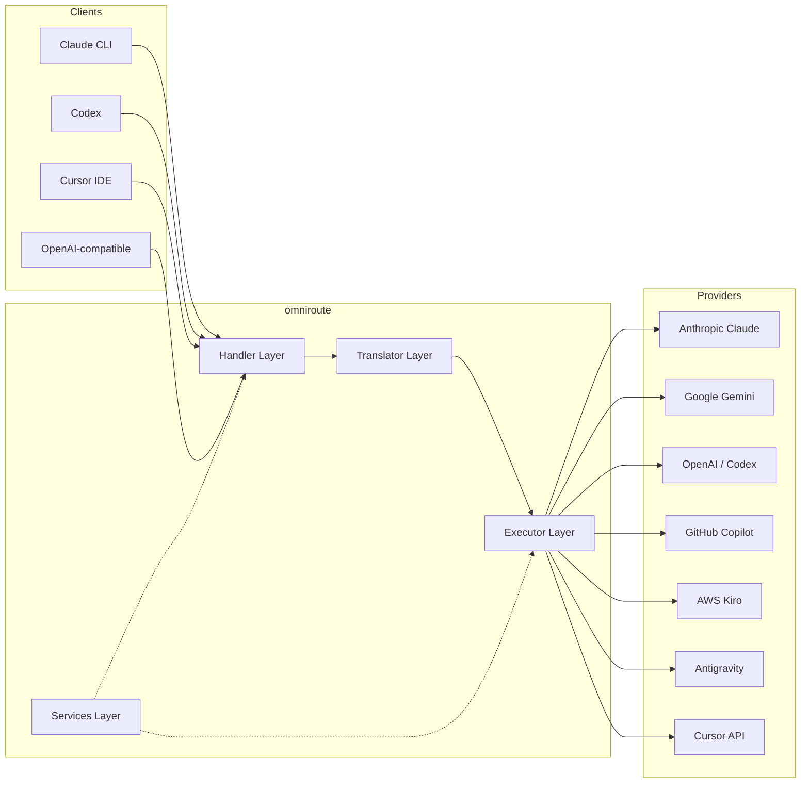

### المبدأ الأساسي: الترجمة المحورية

تمر جميع ترجمة التنسيقات عبر **تنسيق OpenAI كمركز**:

```
Client Format → [OpenAI Hub] → Provider Format    (request)
Provider Format → [OpenAI Hub] → Client Format    (response)
```

هذا يعني أنك تحتاج فقط إلى مترجمين **N** (واحد لكل تنسيق) بدلاً من **N²** (كل زوج).

---

## 3. هيكل المشروع

```
omniroute/
├── open-sse/                  ← Core proxy library (portable, framework-agnostic)
│   ├── index.js               ← Main entry point, exports everything
│   ├── config/                ← Configuration & constants
│   ├── executors/             ← Provider-specific request execution
│   ├── handlers/              ← Request handling orchestration
│   ├── services/              ← Business logic (auth, models, fallback, usage)
│   ├── translator/            ← Format translation engine
│   │   ├── request/           ← Request translators (8 files)
│   │   ├── response/          ← Response translators (7 files)
│   │   └── helpers/           ← Shared translation utilities (6 files)
│   └── utils/                 ← Utility functions
├── src/                       ← Application layer (Express/Worker runtime)
│   ├── app/                   ← Web UI, API routes, middleware
│   ├── lib/                   ← Database, auth, and shared library code
│   ├── mitm/                  ← Man-in-the-middle proxy utilities
│   ├── models/                ← Database models
│   ├── shared/                ← Shared utilities (wrappers around open-sse)
│   ├── sse/                   ← SSE endpoint handlers
│   └── store/                 ← State management
├── data/                      ← Runtime data (credentials, logs)
│   └── provider-credentials.json   (external credentials override, gitignored)
└── tester/                    ← Test utilities
```

---

## 4. تفصيل الوحدة تلو الأخرى

### 4.1 التكوين (`open-sse/config/`)

**المصدر الوحيد للحقيقة** لجميع إعدادات الموفر.

| ملف                           | الغرض                                                                                                                                                                                                                        |
| ----------------------------- | ---------------------------------------------------------------------------------------------------------------------------------------------------------------------------------------------------------------------------- |
| `constants.ts`                | كائن `PROVIDERS` يحتوي على عناوين URL الأساسية وبيانات اعتماد OAuth (الافتراضية) والرؤوس ومطالبات النظام الافتراضية لكل موفر. يحدد أيضًا `HTTP_STATUS`، و`ERROR_TYPES`، و`COOLDOWN_MS`، و`BACKOFF_CONFIG`، و`SKIP_PATTERNS`. |
| `credentialLoader.ts`         | يقوم بتحميل بيانات الاعتماد الخارجية من `data/provider-credentials.json` ويدمجها في الإعدادات الافتراضية المشفرة في `PROVIDERS`. يحافظ على الأسرار خارج نطاق التحكم بالمصدر مع الحفاظ على التوافق مع الإصدارات السابقة.      |
| `providerModels.ts`           | سجل النموذج المركزي: الأسماء المستعارة لموفر الخرائط → معرفات النموذج. وظائف مثل `getModels()`، `getProviderByAlias()`.                                                                                                      |
| `codexInstructions.ts`        | تعليمات النظام التي تم إدخالها في طلبات الدستور الغذائي (قيود التحرير، قواعد الاختبار، سياسات الموافقة).                                                                                                                     |
| `defaultThinkingSignature.ts` | توقيعات "التفكير" الافتراضية لنماذج كلود وجيميني.                                                                                                                                                                            |
| `ollamaModels.ts`             | تعريف المخطط لنماذج أولاما المحلية (الاسم، الحجم، العائلة، التكميم).                                                                                                                                                         |

#### تدفق تحميل بيانات الاعتماد

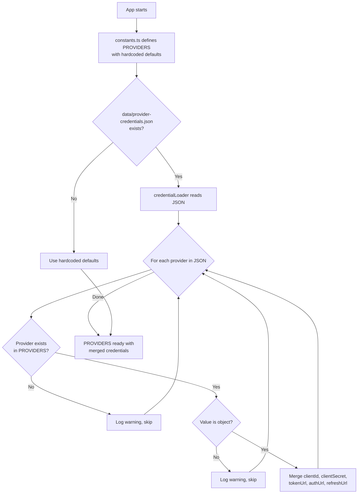

---

### 4.2 المنفذون (`open-sse/executors/`)

يقوم المنفذون بتغليف **المنطق الخاص بالمزود** باستخدام **نمط الإستراتيجية**. يتجاوز كل منفذ الأساليب الأساسية حسب الحاجة.

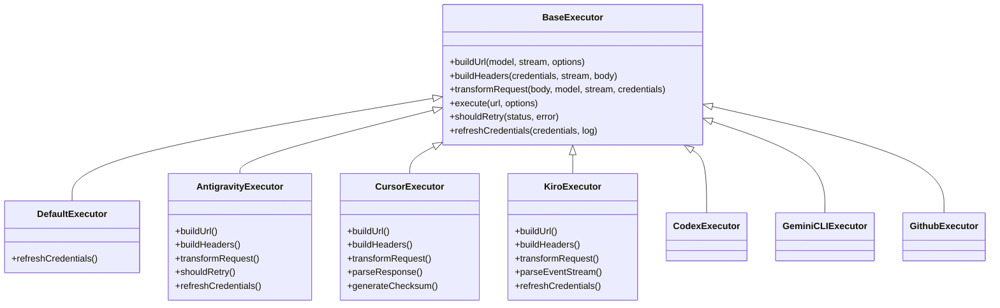

| المنفذ           | مقدم                                                | التخصصات الرئيسية                                                                                                                                   |
| ---------------- | --------------------------------------------------- | --------------------------------------------------------------------------------------------------------------------------------------------------- |
| `base.ts`        | —                                                   | قاعدة الملخصات: إنشاء عنوان URL، والرؤوس، ومنطق إعادة المحاولة، وتحديث بيانات الاعتماد                                                              |
| `default.ts`     | كلود، جيميني، أوبن آي آي، جي إل إم، كيمي، ميني ماكس | تحديث رمز OAuth العام للموفرين القياسيين                                                                                                            |
| `antigravity.ts` | جوجل كلاود كود                                      | إنشاء معرف المشروع/الجلسة، وإرجاع عناوين URL المتعددة، وإعادة محاولة التحليل المخصصة من رسائل الخطأ ("إعادة التعيين بعد 2 ساعة و7 دقائق و23 ثانية") |
| `cursor.ts`      | بيئة تطوير متكاملة للمؤشر                           | **الأكثر تعقيدًا**: مصادقة المجموع الاختباري SHA-256، وترميز طلب Protobuf، وEventStream الثنائي → تحليل استجابة SSE                                 |
| `codex.ts`       | OpenAI Codex                                        | إدخال تعليمات النظام، وإدارة مستويات التفكير، وإزالة المعلمات غير المدعومة                                                                          |
| `gemini-cli.ts`  | جوجل الجوزاء CLI                                    | بناء عنوان URL المخصص (`streamGenerateContent`)، تحديث رمز OAuth المميز لـ Google                                                                   |
| `github.ts`      | جيثب مساعد الطيار                                   | نظام الرمز المزدوج (GitHub OAuth + Copilot token)، محاكاة رأس VSCode                                                                                |
| `kiro.ts`        | AWS CodeWhisperer                                   | التحليل الثنائي لـ AWS EventStream، وإطارات أحداث AMZN، وتقدير الرمز المميز                                                                         |
| `index.ts`       | —                                                   | المصنع: اسم موفر الخرائط ← فئة المنفذ، مع خيار احتياطي افتراضي                                                                                      |

---

### 4.3 المعالجات (`open-sse/handlers/`)

**طبقة التنسيق** — تتولى تنسيق الترجمة والتنفيذ والتدفق ومعالجة الأخطاء.

| ملف                   | الغرض                                                                                                                                                                                              |
| --------------------- | -------------------------------------------------------------------------------------------------------------------------------------------------------------------------------------------------- |
| `chatCore.ts`         | ** المنسق المركزي ** (~ 600 سطر). يتعامل مع دورة حياة الطلب الكاملة: اكتشاف التنسيق ← الترجمة ← إرسال المنفذ ← استجابة التدفق/غير المتدفق ← تحديث الرمز المميز ← معالجة الأخطاء ← تسجيل الاستخدام. |
| `responsesHandler.ts` | محول واجهة برمجة تطبيقات استجابات OpenAI: يحول تنسيق الردود ← إكمالات الدردشة ← يرسل إلى `chatCore` ← يحول SSE مرة أخرى إلى تنسيق الردود.                                                          |
| `embeddings.ts`       | معالج إنشاء التضمين: يحل نموذج التضمين → الموفر، ويرسل إلى واجهة برمجة تطبيقات الموفر، ويعيد استجابة التضمين المتوافقة مع OpenAI. يدعم 6+ مقدمي الخدمات.                                           |
| `imageGeneration.ts`  | معالج إنشاء الصور: يحل نموذج الصورة → الموفر، ويدعم الأوضاع المتوافقة مع OpenAI، وGemini-image (Antigravity)، والوضع الاحتياطي (Nebius). إرجاع صور base64 أو URL.                                  |

#### دورة حياة الطلب (chatCore.ts)

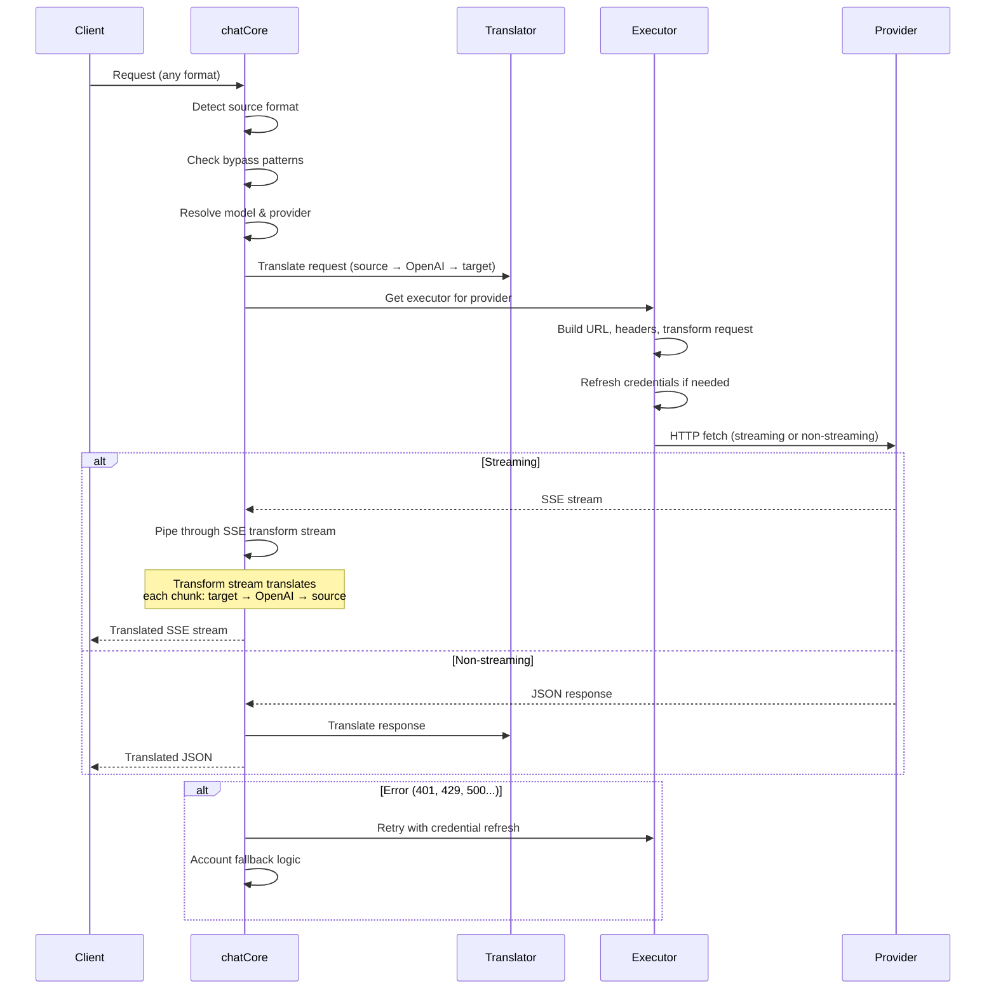

---

### 4.4 الخدمات (`open-sse/services/`)

منطق الأعمال الذي يدعم المعالجات والمنفذين.

| ملف                  | الغرض                                                                                                                                                                                                                                                                                           |
| -------------------- | ----------------------------------------------------------------------------------------------------------------------------------------------------------------------------------------------------------------------------------------------------------------------------------------------- |
| `provider.ts`        | **كشف التنسيق** (`detectFormat`): تحليلات بنية الجسم لتحديد تنسيقات Claude/OpenAI/Gemini/Antigravity/Responses (تتضمن `max_tokens` الاستدلال لكلود). أيضًا: بناء عنوان URL، وبناء الرأس، وتطبيع تكوين التفكير. يدعم موفري الخدمات الديناميكيين `openai-compatible-*` و`anthropic-compatible-*`. |
| `model.ts`           | تحليل سلسلة النموذج (`claude/model-name` → `{provider: "claude", model: "model-name"}`)، ودقة الاسم المستعار مع اكتشاف التصادم، وتعقيم الإدخال (يرفض أحرف اجتياز المسار/التحكم)، ودقة معلومات النموذج مع دعم getter للاسم المستعار غير المتزامن.                                                |
| `accountFallback.ts` | التعامل مع الحد الأقصى للمعدل: التراجع الأسي (1s → 2s → 4s → 2min كحد أقصى)، وإدارة فترة تهدئة الحساب، وتصنيف الأخطاء (أي الأخطاء تؤدي إلى التراجع مقابل عدم حدوثه).                                                                                                                            |
| `tokenRefresh.ts`    | تحديث رمز OAuth المميز **لكل مزود**: Google (Gemini، Antigravity)، Claude، Codex، Qwen، iFlow، GitHub (OAuth + Copilot Dual-Token)، Kiro (AWS SSO OIDC + Social Auth). يتضمن ذاكرة تخزين مؤقت لإلغاء البيانات المكررة أثناء الرحلة وإعادة المحاولة مع التراجع المتسارع.                         |
| `combo.ts`           | **نماذج مجمعة**: سلاسل من النماذج الاحتياطية. إذا فشل النموذج A مع وجود خطأ مؤهل للرجوع إليه، فجرّب النموذج B، ثم C، وما إلى ذلك. يقوم بإرجاع رموز الحالة الأولية الفعلية.                                                                                                                      |
| `usage.ts`           | جلب بيانات الحصص/الاستخدام من واجهات برمجة تطبيقات الموفر (حصص GitHub Copilot، وحصص نماذج Antigravity، وحدود معدل Codex، وأعطال استخدام Kiro، وإعدادات Claude).                                                                                                                                 |
| `accountSelector.ts` | اختيار الحساب الذكي باستخدام خوارزمية التسجيل: يأخذ في الاعتبار الأولوية والحالة الصحية والموضع الدائري وحالة التهدئة لاختيار الحساب الأمثل لكل طلب.                                                                                                                                            |
| `contextManager.ts`  | إدارة دورة حياة سياق الطلب: إنشاء وتتبع كائنات السياق لكل طلب باستخدام بيانات التعريف (معرف الطلب، والطوابع الزمنية، ومعلومات الموفر) لتصحيح الأخطاء والتسجيل.                                                                                                                                  |
| `ipFilter.ts`        | التحكم في الوصول المستند إلى IP: يدعم وضعي القائمة المسموح بها والقائمة المحظورة. التحقق من صحة عنوان IP للعميل مقابل القواعد التي تم تكوينها قبل معالجة طلبات واجهة برمجة التطبيقات.                                                                                                           |
| `sessionManager.ts`  | تتبع الجلسة باستخدام بصمة العميل: يتتبع الجلسات النشطة باستخدام معرفات العميل المجزأة، ويراقب عدد الطلبات، ويوفر مقاييس الجلسة.                                                                                                                                                                 |
| `signatureCache.ts`  | طلب ذاكرة التخزين المؤقت لإلغاء البيانات المكررة المستندة إلى التوقيع: يمنع الطلبات المكررة عن طريق تخزين توقيعات الطلب الأخيرة مؤقتًا وإرجاع الاستجابات المخزنة مؤقتًا للطلبات المتطابقة خلال نافذة زمنية.                                                                                     |
| `systemPrompt.ts`    | الحقن الفوري للنظام العالمي: يُلحق أو يُلحق موجه نظام قابل للتكوين لجميع الطلبات، مع معالجة التوافق لكل مزود.                                                                                                                                                                                   |
| `thinkingBudget.ts`  | إدارة ميزانية الرموز المميزة: تدعم أوضاع المرور، والتلقائي (تكوين التفكير الشريطي)، والمخصص (الميزانية الثابتة)، والتكيفية (مدرجة التعقيد) للتحكم في رموز التفكير/الاستدلال.                                                                                                                    |
| `wildcardRouter.ts`  | توجيه نمط نموذج حرف البدل: يحل أنماط حرف البدل (على سبيل المثال، `*/claude-*`) لأزواج الموفر/النموذج الملموسة بناءً على التوفر والأولوية.                                                                                                                                                       |

#### إلغاء البيانات المكررة لتحديث الرمز المميز

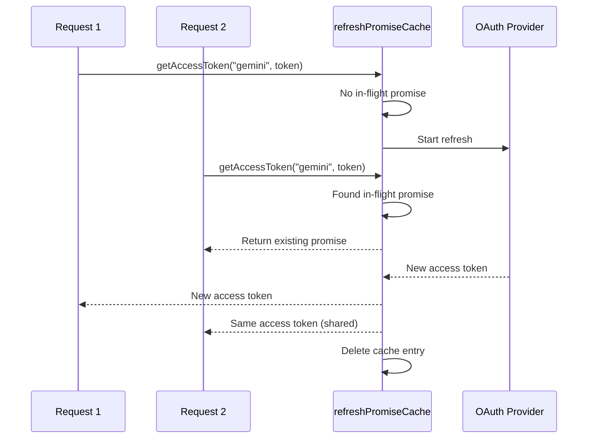

#### آلة الحالة الاحتياطية للحساب

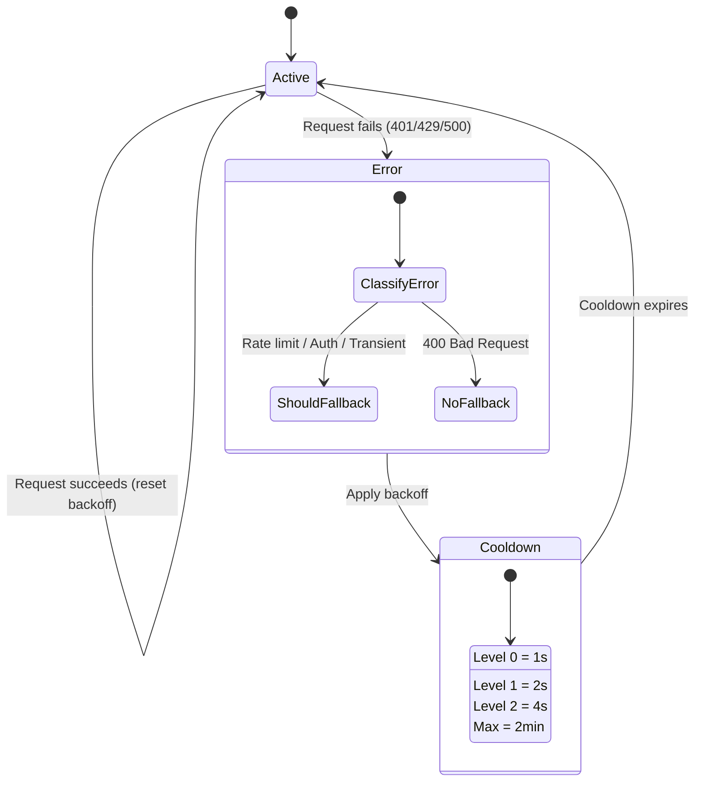

#### سلسلة نماذج كومبو

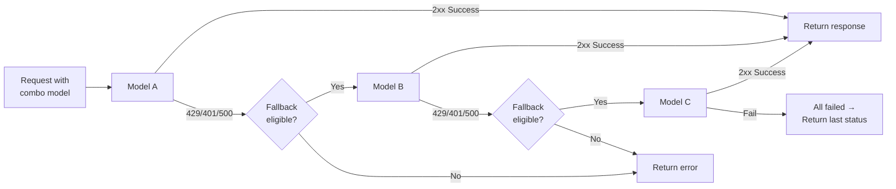

---

### مترجم 4.5 (`open-sse/translator/`)

**محرك ترجمة التنسيق** باستخدام نظام إضافي للتسجيل الذاتي.

####الهندسة المعمارية

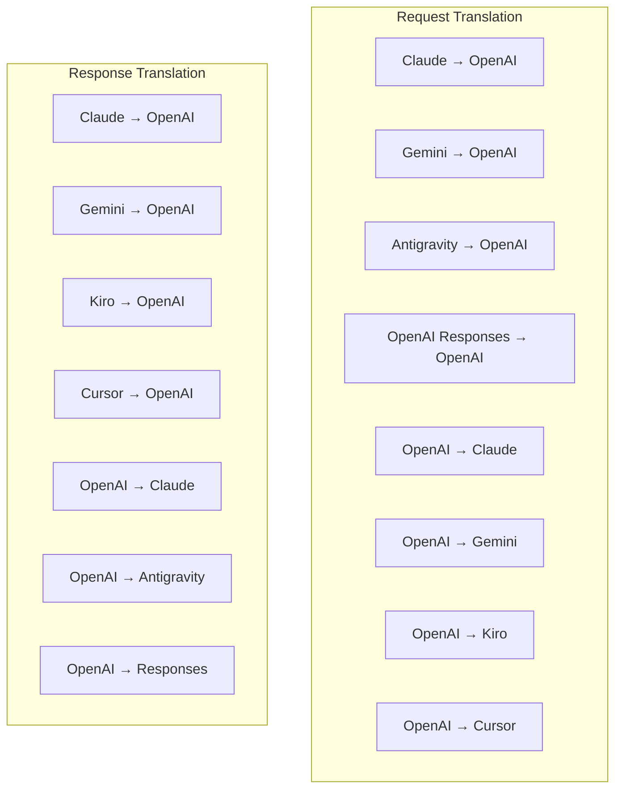

| الدليل       | ملفات     | الوصف                                                                                                                                                                                                                                                       |
| ------------ | --------- | ----------------------------------------------------------------------------------------------------------------------------------------------------------------------------------------------------------------------------------------------------------- |
| `request/`   | 8 مترجمين | تحويل أجسام الطلب بين الصيغ. يتم تسجيل كل ملف ذاتيًا عبر `register(from, to, fn)` عند الاستيراد.                                                                                                                                                            |
| `response/`  | 7 مترجمين | تحويل قطع الاستجابة المتدفقة بين الصيغ. يتعامل مع أنواع أحداث SSE وكتل التفكير واستدعاءات الأدوات.                                                                                                                                                          |
| `helpers/`   | 6 مساعدين | الأدوات المساعدة المشتركة: `claudeHelper` (استخراج موجه النظام، تكوين التفكير)، `geminiHelper` (تعيين الأجزاء/المحتويات)، `openaiHelper` (تصفية التنسيق)، `toolCallHelper` (إنشاء المعرف، حقن الاستجابة المفقودة)، `maxTokensHelper`، `responsesApiHelper`. |
| `index.ts`   | —         | محرك الترجمة: `translateRequest()`، `translateResponse()`، إدارة الحالة، التسجيل.                                                                                                                                                                           |
| `formats.ts` | —         | ثوابت التنسيق: `OPENAI`، `CLAUDE`، `GEMINI`، `ANTIGRAVITY`، `KIRO`، `CURSOR`، `OPENAI_RESPONSES`.                                                                                                                                                           |

#### التصميم الرئيسي: المكونات الإضافية للتسجيل الذاتي

```javascript
// Each translator file calls register() on import:
import { register } from "../index.js";
register("claude", "openai", translateClaudeToOpenAI);

// The index.js imports all translator files, triggering registration:
import "./request/claude-to-openai.js"; // ← self-registers
```

---

### 4.6 الأدوات المساعدة (`open-sse/utils/`)

| ملف                | الغرض                                                                                                                                                                                                                                                                            |
| ------------------ | -------------------------------------------------------------------------------------------------------------------------------------------------------------------------------------------------------------------------------------------------------------------------------- |
| `error.ts`         | إنشاء استجابة للأخطاء (تنسيق متوافق مع OpenAI)، وتحليل الأخطاء الأولية، واستخراج وقت إعادة محاولة Antigravity من رسائل الخطأ، وتدفق أخطاء SSE.                                                                                                                                   |
| `stream.ts`        | **SSE Transform Stream** — خط أنابيب البث الأساسي. وضعان: `TRANSLATE` (ترجمة التنسيق الكامل) و`PASSTHROUGH` (تطبيع + استخراج الاستخدام). يتعامل مع التخزين المؤقت للقطعة وتقدير الاستخدام وتتبع طول المحتوى. تتجنب مثيلات وحدة التشفير/وحدة فك التشفير لكل تيار الحالة المشتركة. |
| `streamHelpers.ts` | أدوات SSE ذات المستوى المنخفض: `parseSSELine` (تتحمل المسافات البيضاء)، `hasValuableContent` (تصفية الأجزاء الفارغة لـ OpenAI/Claude/Gemini)، `fixInvalidId`، `formatSSE` (تسلسل SSE مدرك للتنسيق مع تنظيف `perf_metrics`).                                                      |
| `usageTracking.ts` | استخراج استخدام الرمز المميز من أي تنسيق (Claude/OpenAI/Gemini/Responses)، والتقدير باستخدام نسب الأحرف لكل رمز مميز للأداة/الرسالة، وإضافة المخزن المؤقت (هامش أمان 2000 رمز مميز)، وتصفية الحقول الخاصة بالتنسيق، وتسجيل وحدة التحكم بألوان ANSI.                              |
| `requestLogger.ts` | تسجيل الطلب المستند إلى الملف (الاشتراك عبر `ENABLE_REQUEST_LOGS=true`). ينشئ مجلدات الجلسة بملفات مرقمة: `1_req_client.json` → `7_res_client.txt`. كل عمليات الإدخال/الإخراج غير متزامنة (أطلق النار وانسى). أقنعة الرؤوس الحساسة.                                              |
| `bypassHandler.ts` | يعترض أنماطًا محددة من Claude CLI (استخراج العنوان، والتحمية، والعد) ويعيد استجابات مزيفة دون الاتصال بأي مزود. يدعم كلا من الدفق وغير الدفق. يقتصر عمدا على نطاق كلود CLI.                                                                                                      |
| `networkProxy.ts`  | يحل عنوان URL للوكيل الصادر لموفر معين مع الأسبقية: التكوين الخاص بالموفر → التكوين العام → متغيرات البيئة (`HTTPS_PROXY`/`HTTP_PROXY`/`ALL_PROXY`). يدعم استثناءات `NO_PROXY`. تكوين ذاكرة التخزين المؤقت لمدة 30 ثانية.                                                        |

#### خط أنابيب تدفق SSE

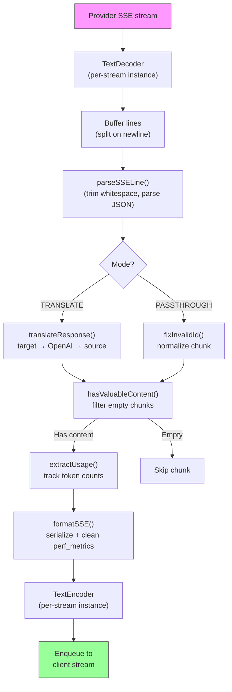

#### بنية جلسة مسجل الطلب

```
logs/
└── claude_gemini_claude-sonnet_20260208_143045/
    ├── 1_req_client.json      ← Raw client request
    ├── 2_req_source.json      ← After initial conversion
    ├── 3_req_openai.json      ← OpenAI intermediate format
    ├── 4_req_target.json      ← Final target format
    ├── 5_res_provider.txt     ← Provider SSE chunks (streaming)
    ├── 5_res_provider.json    ← Provider response (non-streaming)
    ├── 6_res_openai.txt       ← OpenAI intermediate chunks
    ├── 7_res_client.txt       ← Client-facing SSE chunks
    └── 6_error.json           ← Error details (if any)
```

---

### 4.7 طبقة التطبيق (`src/`)

| الدليل        | الغرض                                                                                                   |
| ------------- | ------------------------------------------------------------------------------------------------------- |
| `src/app/`    | واجهة مستخدم الويب، مسارات واجهة برمجة التطبيقات (API)، البرامج الوسيطة السريعة، معالجات رد اتصال OAuth |
| `src/lib/`    | الوصول إلى قاعدة البيانات (`localDb.ts`، `usageDb.ts`)، المصادقة، مشتركة                                |
| `src/mitm/`   | أدوات مساعدة للوكيل الوسيط لاعتراض حركة مرور الموفر                                                     |
| `src/models/` | تعريفات نماذج قواعد البيانات                                                                            |
| `src/shared/` | أغلفة حول وظائف open-sse (المزود، الدفق، الخطأ، إلخ)                                                    |
| `src/sse/`    | معالجات نقطة نهاية SSE التي تربط مكتبة open-sse بمسارات Express                                         |
| `src/store/`  | إدارة حالة التطبيق                                                                                      |

#### مسارات API البارزة

| الطريق                                        | طرق                | الغرض                                                                          |
| --------------------------------------------- | ------------------ | ------------------------------------------------------------------------------ |
| `/api/provider-models`                        | الحصول على/نشر/حذف | CRUD للنماذج المخصصة لكل مزود                                                  |
| `/api/models/catalog`                         | احصل على           | كتالوج مجمع لجميع النماذج (الدردشة، التضمين، الصورة، المخصصة) مجمعة حسب الموفر |
| `/api/settings/proxy`                         | الحصول على/وضع/حذف | تكوين الوكيل الصادر الهرمي (`global/providers/combos/keys`)                    |
| `/api/settings/proxy/test`                    | مشاركة             | التحقق من صحة اتصال الوكيل وإرجاع IP/زمن الوصول العام                          |
| `/v1/providers/[provider]/chat/completions`   | مشاركة             | عمليات إكمال الدردشة المخصصة لكل مزود مع التحقق من صحة النموذج                 |
| `/v1/providers/[provider]/embeddings`         | مشاركة             | عمليات التضمين المخصصة لكل مزود مع التحقق من صحة النموذج                       |
| `/v1/providers/[provider]/images/generations` | مشاركة             | إنشاء صور مخصصة لكل مزود مع التحقق من صحة النموذج                              |
| `/api/settings/ip-filter`                     | الحصول على/وضع     | قائمة IP المسموح بها/إدارة القائمة المحظورة                                    |
| `/api/settings/thinking-budget`               | الحصول على/وضع     | تكوين ميزانية الرمز المميز (العبور/التلقائي/المخصص/التكيفي)                    |
| `/api/settings/system-prompt`                 | الحصول على/وضع     | الحقن الفوري للنظام العالمي لجميع الطلبات                                      |
| `/api/sessions`                               | احصل على           | تتبع الجلسة النشطة ومقاييسها                                                   |
| `/api/rate-limits`                            | احصل على           | حالة حد المعدل لكل حساب                                                        |

---

## 5. أنماط التصميم الرئيسية

### 5.1 الترجمة المحورية والمتحدثة

تتم ترجمة جميع التنسيقات من خلال **تنسيق OpenAI كمحور**. لا تتطلب إضافة موفر جديد سوى كتابة **زوج واحد** من المترجمين (من/إلى OpenAI)، وليس عدد N من المترجمين.

### 5.2 نمط استراتيجية المنفذ

كل مزود لديه فئة منفذة مخصصة ترث من `BaseExecutor`. يقوم المصنع في `executors/index.ts` باختيار المصنع المناسب في وقت التشغيل.

### 5.3 نظام البرنامج المساعد للتسجيل الذاتي

تسجل وحدات المترجم نفسها عند الاستيراد عبر `register()`. إن إضافة مترجم جديد يعني مجرد إنشاء ملف واستيراده.

### 5.4 التراجع في الحساب مع التراجع الأسي

عندما يقوم مقدم الخدمة بإرجاع 429/401/500، يمكن للنظام التبديل إلى الحساب التالي، مع تطبيق فترات التباطؤ الأسية (1ث → 2ث → 4ث → 2 دقيقة كحد أقصى).

### 5.5 سلاسل نماذج كومبو

يقوم "التحرير والسرد" بتجميع سلاسل `provider/model` متعددة. إذا فشل الأول، يتم الرجوع إلى التالي تلقائيًا.

### 5.6 ترجمة متدفقة رائعة

تحافظ ترجمة الاستجابة على الحالة عبر أجزاء SSE (تتبع كتلة التفكير، وتراكم استدعاءات الأداة، وفهرسة كتلة المحتوى) عبر آلية `initState()`.

### 5.7 المخزن المؤقت لسلامة الاستخدام

تتم إضافة مخزن مؤقت مكون من 2000 رمز مميز إلى الاستخدام المبلغ عنه لمنع العملاء من الوصول إلى حدود نافذة السياق بسبب الحمل الزائد من مطالبات النظام وترجمة التنسيق.

---

## 6. التنسيقات المدعومة

| تنسيق                               | الاتجاه        | المعرف             |
| ----------------------------------- | -------------- | ------------------ |
| استكمالات الدردشة OpenAI            | المصدر + الهدف | `openai`           |
| واجهة برمجة تطبيقات استجابات OpenAI | المصدر + الهدف | `openai-responses` |
| أنثروبي كلود                        | المصدر + الهدف | `claude`           |
| جوجل الجوزاء                        | المصدر + الهدف | `gemini`           |
| جوجل الجوزاء CLI                    | الهدف فقط      | `gemini-cli`       |
| مكافحة الجاذبية                     | المصدر + الهدف | `antigravity`      |
| أوس كيرو                            | الهدف فقط      | `kiro`             |
| المؤشر                              | الهدف فقط      | `cursor`           |

---

## 7. مقدمو الخدمة المدعومين

| مقدم                      | طريقة المصادقة           | المنفذ          | الملاحظات الرئيسية                                        |
| ------------------------- | ------------------------ | --------------- | --------------------------------------------------------- |
| أنثروبي كلود              | مفتاح API أو OAuth       | الافتراضي       | يستخدم رأس `x-api-key`                                    |
| جوجل الجوزاء              | مفتاح API أو OAuth       | الافتراضي       | يستخدم رأس `x-goog-api-key`                               |
| جوجل الجوزاء CLI          | أووث                     | الجوزاء كلي     | يستخدم `streamGenerateContent` نقطة النهاية               |
| مكافحة الجاذبية           | أووث                     | مكافحة الجاذبية | احتياطي عناوين URL المتعددة، إعادة محاولة التحليل المخصصة |
| أوبن آي                   | مفتاح API                | الافتراضي       | مصادقة حامل المعيار                                       |
| الدستور الغذائي           | أووث                     | الدستور الغذائي | يدخل تعليمات النظام ويدير التفكير                         |
| جيثب مساعد الطيار         | OAuth + رمز مساعد الطيار | جيثب            | رمز مزدوج، محاكاة رأس VSCode                              |
| كيرو (AWS)                | AWS SSO OIDC أو Social   | كيرو            | تحليل دفق الأحداث الثنائية                                |
| بيئة تطوير متكاملة للمؤشر | مصادقة المجموع الاختباري | المؤشر          | ترميز Protobuf، المجموع الاختباري SHA-256                 |
| كوين                      | أووث                     | الافتراضي       | المصادقة القياسية                                         |
| اي فلو                    | OAuth (أساسي + حامل)     | الافتراضي       | رأس المصادقة المزدوجة                                     |
| اوبن راوتر                | مفتاح API                | الافتراضي       | مصادقة حامل المعيار                                       |
| جي إل إم، كيمي، ميني ماكس | مفتاح API                | الافتراضي       | متوافق مع كلود، استخدم `x-api-key`                        |
| `openai-compatible-*`     | مفتاح API                | الافتراضي       | ديناميكي: أي نقطة نهاية متوافقة مع OpenAI                 |
| `anthropic-compatible-*`  | مفتاح API                | الافتراضي       | ديناميكي: أي نقطة نهاية متوافقة مع كلود                   |

---

## 8. ملخص تدفق البيانات

### طلب البث

```mermaid
flowchart LR
    A["Client"] --> B["detectFormat()"]
    B --> C["translateRequest()\nsource → OpenAI → target"]
    C --> D["Executor\nbuildUrl + buildHeaders"]
    D --> E["fetch(providerURL)"]
    E --> F["createSSEStream()\nTRANSLATE mode"]
    F --> G["parseSSELine()"]
    G --> H["translateResponse()\ntarget → OpenAI → source"]
    H --> I["extractUsage()\n+ addBuffer"]
    I --> J["formatSSE()"]
    J --> K["Client receives\ntranslated SSE"]
    K --> L["logUsage()\nsaveRequestUsage()"]
```

### طلب عدم البث

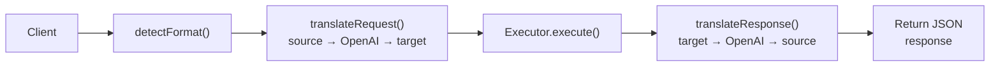

### تجاوز التدفق (كلود CLI)

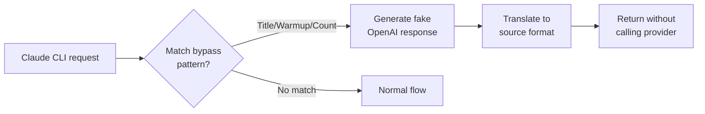
