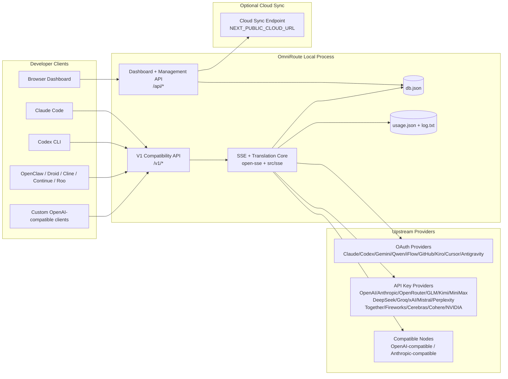
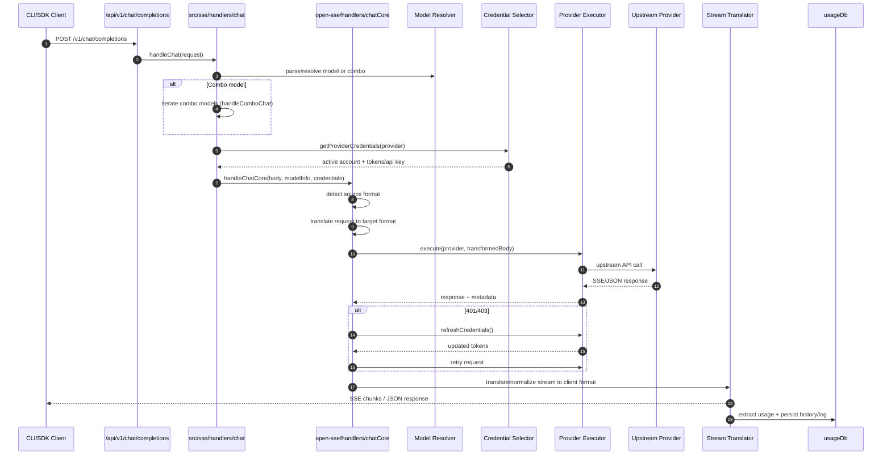
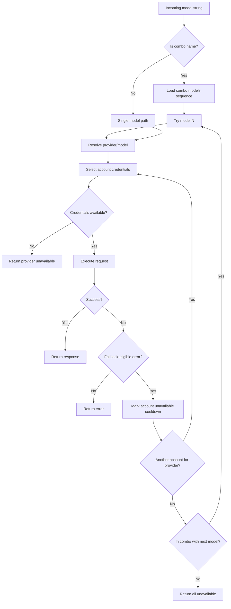
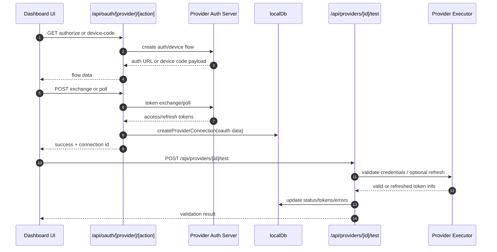
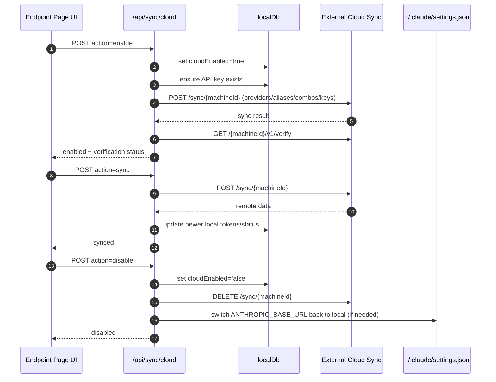
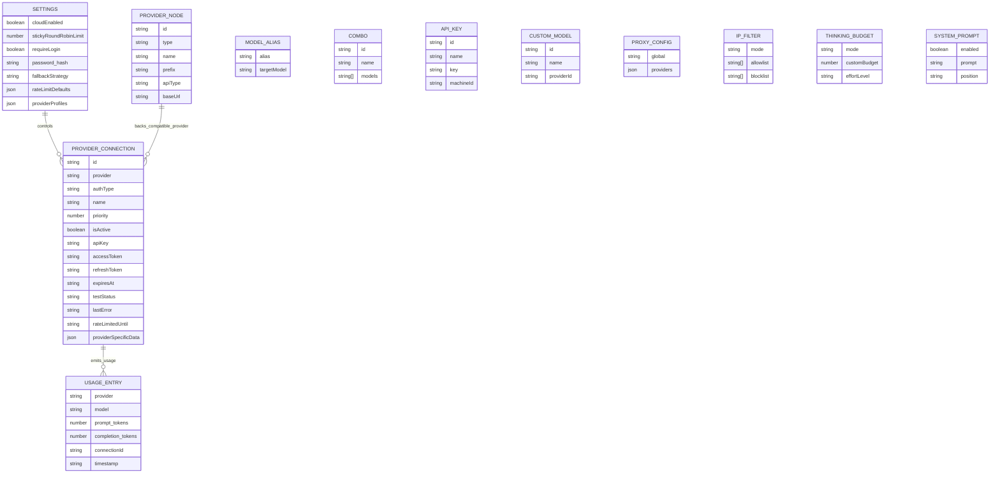
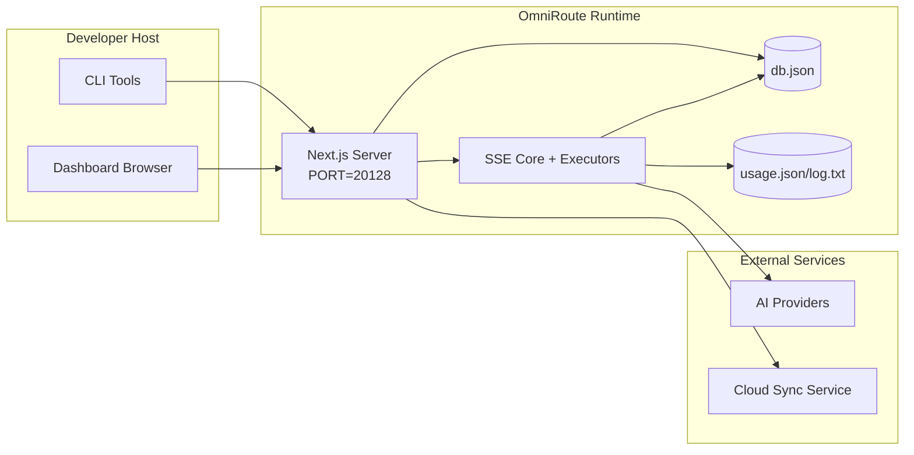

# Архитектура OmniRoute

🌐 **Languages:** 🇺🇸 [English](../../ARCHITECTURE.md) | 🇧🇷 [Português (Brasil)](../pt-BR/ARCHITECTURE.md) | 🇪🇸 [Español](../es/ARCHITECTURE.md) | 🇫🇷 [Français](../fr/ARCHITECTURE.md) | 🇮🇹 [Italiano](../it/ARCHITECTURE.md) | 🇷🇺 [Русский](../ru/ARCHITECTURE.md) | 🇨🇳 [中文 (简体)](../zh-CN/ARCHITECTURE.md) | 🇩🇪 [Deutsch](../de/ARCHITECTURE.md) | 🇮🇳 [हिन्दी](../in/ARCHITECTURE.md) | 🇹🇭 [ไทย](../th/ARCHITECTURE.md) | 🇺🇦 [Українська](../uk-UA/ARCHITECTURE.md) | 🇸🇦 [العربية](../ar/ARCHITECTURE.md) | 🇯🇵 [日本語](../ja/ARCHITECTURE.md) | 🇻🇳 [Tiếng Việt](../vi/ARCHITECTURE.md) | 🇧🇬 [Български](../bg/ARCHITECTURE.md) | 🇩🇰 [Dansk](../da/ARCHITECTURE.md) | 🇫🇮 [Suomi](../fi/ARCHITECTURE.md) | 🇮🇱 [עברית](../he/ARCHITECTURE.md) | 🇭🇺 [Magyar](../hu/ARCHITECTURE.md) | 🇮🇩 [Bahasa Indonesia](../id/ARCHITECTURE.md) | 🇰🇷 [한국어](../ko/ARCHITECTURE.md) | 🇲🇾 [Bahasa Melayu](../ms/ARCHITECTURE.md) | 🇳🇱 [Nederlands](../nl/ARCHITECTURE.md) | 🇳🇴 [Norsk](../no/ARCHITECTURE.md) | 🇵🇹 [Português (Portugal)](../pt/ARCHITECTURE.md) | 🇷🇴 [Română](../ro/ARCHITECTURE.md) | 🇵🇱 [Polski](../pl/ARCHITECTURE.md) | 🇸🇰 [Slovenčina](../sk/ARCHITECTURE.md) | 🇸🇪 [Svenska](../sv/ARCHITECTURE.md) | 🇵🇭 [Filipino](../phi/ARCHITECTURE.md)

_Последна актуализация: 2026-02-18_

## Резюме

OmniRoute е локален AI маршрутизиращ шлюз и табло за управление, изградено на Next.js.
Той осигурява една крайна точка, съвместима с OpenAI (`/v1/*`) и маршрутизира трафика през множество доставчици нагоре по веригата с превод, резервен вариант, опресняване на токени и проследяване на използването.

Основни възможности:

- OpenAI-съвместима API повърхност за CLI/инструменти (28 доставчици)
- Превод на заявка/отговор във форматите на доставчика
- Резервна комбинация от модели (последователност от няколко модела)
- Резервен вариант на ниво акаунт (мулти акаунт на доставчик)
- OAuth + API-ключ управление на връзката на доставчика
- Генериране на вграждане чрез `/v1/embeddings` (6 доставчика, 9 модела)
- Генериране на изображения чрез `/v1/images/generations` (4 доставчика, 9 модела)
- Мислен синтактичен анализ на етикет (`<think>...</think>`) за модели на разсъждение
- Дезинфекция на отговора за стриктна съвместимост с OpenAI SDK
- Нормализиране на ролята (разработчик→система, система→потребител) за съвместимост между доставчици
- Структурирано преобразуване на изход (json_schema → Gemini responseSchema)
- Локална устойчивост за доставчици, ключове, псевдоними, комбинации, настройки, ценообразуване
- Проследяване на използване/разходи и регистриране на заявки
- Допълнителна облачна синхронизация за синхронизиране на множество устройства/състояние
- Списък с разрешени/блокирани IP адреси за контрол на достъпа до API
- Мислещо управление на бюджета (преминаване/автоматично/персонализирано/адаптивно)
- Бързо инжектиране на глобалната система
- Проследяване на сесии и пръстови отпечатъци
- Подобрено ограничаване на скоростта за всеки акаунт със специфични за доставчика профили
- Модел на прекъсвача за устойчивост на доставчика
- Анти-гръмотевична стадна защита с mutex заключване
- Кеш за дедупликация на заявки, базиран на подпис
- Слой на домейна: наличност на модела, правила за разходите, резервна политика, политика за блокиране
- Устойчивост на състоянието на домейна (кеш за запис на SQLite за резервни варианти, бюджети, блокировки, прекъсвачи на верига)
- Механизъм за правила за централизирана оценка на заявката (заключване → бюджет → резервен)
- Заявка за телеметрия с p50/p95/p99 агрегиране на латентност
- ID на корелация (X-Request-Id) за проследяване от край до край
- Регистриране на одит за съответствие с отказ за всеки API ключ
- Eval framework за осигуряване на качеството на LLM
- Resilience UI табло със статус на прекъсвача в реално време
- Модулни OAuth доставчици (12 отделни модула под `src/lib/oauth/providers/`)

Основен модел на изпълнение:

- Маршрутите на приложението Next.js под `src/app/api/*` прилагат както API на таблото за управление, така и API за съвместимост
- Споделено SSE/маршрутизиращо ядро в `src/sse/*` + `open-sse/*` обработва изпълнението на доставчика, превода, стрийминг, резервен вариант и използване

## Обхват и граници

### В обхват

- Време за изпълнение на локален шлюз
- API за управление на таблото
- Удостоверяване на доставчика и опресняване на токена
- Заявка за превод и SSE стрийминг
- Локално състояние + постоянство на използване
- Допълнителна синхронизация в облака

### Извън обхвата

- Внедряване на облачна услуга зад `NEXT_PUBLIC_CLOUD_URL`
- SLA/контролна равнина на доставчика извън локалния процес
- Самите външни CLI двоични файлове (Claude CLI, Codex CLI и т.н.)

## Системен контекст на високо ниво



## Основни компоненти по време на изпълнение

## 1) API и слой за маршрутизиране (Маршрути на приложението Next.js)

Основни директории:

- `src/app/api/v1/*` и `src/app/api/v1beta/*` за API за съвместимост
- `src/app/api/*` за API за управление/конфигуриране
- Следващото пренаписване в `next.config.mjs` преобразува `/v1/*` в `/api/v1/*`

Важни пътища за съвместимост:

- `src/app/api/v1/chat/completions/route.ts`
- `src/app/api/v1/messages/route.ts`
- `src/app/api/v1/responses/route.ts`
- `src/app/api/v1/models/route.ts` — включва потребителски модели с `custom: true`
- `src/app/api/v1/embeddings/route.ts` — генериране на вграждане (6 доставчика)
- `src/app/api/v1/images/generations/route.ts` — генериране на изображения (4+ доставчици, вкл. Antigravity/Nebius)
- `src/app/api/v1/messages/count_tokens/route.ts`
- `src/app/api/v1/providers/[provider]/chat/completions/route.ts` — специален чат за всеки доставчик
- `src/app/api/v1/providers/[provider]/embeddings/route.ts` — специални вграждания за всеки доставчик
- `src/app/api/v1/providers/[provider]/images/generations/route.ts` — специални изображения за всеки доставчик
- `src/app/api/v1beta/models/route.ts`
- `src/app/api/v1beta/models/[...path]/route.ts`

Домейни за управление:

- Удостоверяване/настройки: `src/app/api/auth/*`, `src/app/api/settings/*`
- Доставчици/връзки: `src/app/api/providers*`
- Възли на доставчик: `src/app/api/provider-nodes*`
- Персонализирани модели: `src/app/api/provider-models` (GET/POST/DELETE)
- Каталог с модели: `src/app/api/models/catalog` (GET)
- Прокси конфигурация: `src/app/api/settings/proxy` (GET/PUT/DELETE) + `src/app/api/settings/proxy/test` (POST)
- OAuth: `src/app/api/oauth/*`
- Ключове/псевдоними/комбота/цени: `src/app/api/keys*`, `src/app/api/models/alias`, `src/app/api/combos*`, `src/app/api/pricing`
- Използване: `src/app/api/usage/*`
- Синхронизиране/облак: `src/app/api/sync/*`, `src/app/api/cloud/*`
- Помощни инструменти за CLI: `src/app/api/cli-tools/*`
- IP филтър: `src/app/api/settings/ip-filter` (GET/PUT)
- Бюджет за мислене: `src/app/api/settings/thinking-budget` (GET/PUT)
- Системна подкана: `src/app/api/settings/system-prompt` (GET/PUT)
- Сесии: `src/app/api/sessions` (GET)
- Ограничения на скоростта: `src/app/api/rate-limits` (GET)
- Устойчивост: `src/app/api/resilience` (GET/PATCH) — профили на доставчик, прекъсвач, състояние на ограничение на скоростта
- Нулиране на устойчивостта: `src/app/api/resilience/reset` (POST) — нулиране на прекъсвачи + охлаждане
- Кеш статистики: `src/app/api/cache/stats` (ПОЛУЧАВАНЕ/ИЗТРИВАНЕ)
- Наличност на модела: `src/app/api/models/availability` (GET/POST)
- Телеметрия: `src/app/api/telemetry/summary` (GET)
- Бюджет: `src/app/api/usage/budget` (GET/POST)
- Резервни вериги: `src/app/api/fallback/chains` (GET/POST/DELETE)
- Одит за съответствие: `src/app/api/compliance/audit-log` (GET)
- Стойности: `src/app/api/evals` (GET/POST), `src/app/api/evals/[suiteId]` (GET)
- Правила: `src/app/api/policies` (GET/POST)

## 2) SSE + ядро за превод

Основни модули на потока:

- Запис: `src/sse/handlers/chat.ts`
- Основна оркестрация: `open-sse/handlers/chatCore.ts`
- Адаптери за изпълнение на доставчика: `open-sse/executors/*`
- Откриване на формат/конфигурация на доставчика: `open-sse/services/provider.ts`
- Разбор/разрешаване на модела: `src/sse/services/model.ts`, `open-sse/services/model.ts`
- Резервна логика на акаунта: `open-sse/services/accountFallback.ts`
- Регистър на преводите: `open-sse/translator/index.ts`
- Трансформации на потока: `open-sse/utils/stream.ts`, `open-sse/utils/streamHandler.ts`
- Извличане/нормализиране на използването: `open-sse/utils/usageTracking.ts`
- Мислен анализатор на етикети: `open-sse/utils/thinkTagParser.ts`
- Манипулатор за вграждане: `open-sse/handlers/embeddings.ts`
- Регистър на доставчика на вграждане: `open-sse/config/embeddingRegistry.ts`
- Манипулатор за генериране на изображения: `open-sse/handlers/imageGeneration.ts`
- Регистър на доставчика на изображения: `open-sse/config/imageRegistry.ts`
- Саниране на отговора: `open-sse/handlers/responseSanitizer.ts`
- Нормализация на ролята: `open-sse/services/roleNormalizer.ts`

Услуги (бизнес логика):

- Избор/точкуване на акаунт: `open-sse/services/accountSelector.ts`
- Управление на жизнения цикъл на контекста: `open-sse/services/contextManager.ts`
- Налагане на IP филтър: `open-sse/services/ipFilter.ts`
- Проследяване на сесии: `open-sse/services/sessionManager.ts`
- Искане за дедупликация: `open-sse/services/signatureCache.ts`
- Системно бързо инжектиране: `open-sse/services/systemPrompt.ts`
- Мислещо управление на бюджета: `open-sse/services/thinkingBudget.ts`
- Маршрутизиране на модела със заместващи знаци: `open-sse/services/wildcardRouter.ts`
- Управление на лимита на скоростта: `open-sse/services/rateLimitManager.ts`
- Прекъсвач: `open-sse/services/circuitBreaker.ts`

Модули на ниво домейн:

- Наличност на модела: `src/lib/domain/modelAvailability.ts`
- Правила/бюджети за разходите: `src/lib/domain/costRules.ts`
- Резервна политика: `src/lib/domain/fallbackPolicy.ts`
- Комбо резолвер: `src/lib/domain/comboResolver.ts`
- Правила за блокиране: `src/lib/domain/lockoutPolicy.ts`
- Механизъм за правила: `src/domain/policyEngine.ts` — централизирано блокиране → бюджет → резервна оценка
- Каталог с кодове за грешки: `src/lib/domain/errorCodes.ts`
- ID на заявката: `src/lib/domain/requestId.ts`
- Време за изчакване на извличане: `src/lib/domain/fetchTimeout.ts`
- Заявка за телеметрия: `src/lib/domain/requestTelemetry.ts`
- Съответствие/одит: `src/lib/domain/compliance/index.ts`
- Евал бегач: `src/lib/domain/evalRunner.ts`
- Устойчивост на състоянието на домейна: `src/lib/db/domainState.ts` — SQLite CRUD за резервни вериги, бюджети, история на разходите, състояние на блокиране, прекъсвачи

Модули за доставчик на OAuth (12 отделни файла под `src/lib/oauth/providers/`):

- Индекс на регистъра: `src/lib/oauth/providers/index.ts`
- Индивидуални доставчици: `claude.ts`, `codex.ts`, `gemini.ts`, `antigravity.ts`, `iflow.ts`, `qwen.ts`, `kimi-coding.ts`, `github.ts`, `kiro.ts`, `cursor.ts`, `kilocode.ts`, `cline.ts`
- Тънка обвивка: `src/lib/oauth/providers.ts` — повторно експортиране от отделни модули

## 3) Слой за устойчивост

Основно състояние DB:

- `src/lib/localDb.ts`
- файл: `${DATA_DIR}/db.json` (или `$XDG_CONFIG_HOME/omniroute/db.json`, когато е зададено, в противен случай `~/.omniroute/db.json`)
- обекти: providerConnections, providerNodes, modelAliases, комбинации, apiKeys, настройки, ценообразуване, **customModels**, **proxyConfig**, **ipFilter**, **thinkingBudget**, **systemPrompt**

DB за използване:

- `src/lib/usageDb.ts`
- файлове: `${DATA_DIR}/usage.json`, `${DATA_DIR}/log.txt`, `${DATA_DIR}/call_logs/`
- следва същата основна политика за директория като `localDb` (`DATA_DIR`, след това `XDG_CONFIG_HOME/omniroute`, когато е зададено)
- разложен на фокусирани подмодули: `migrations.ts`, `usageHistory.ts`, `costCalculator.ts`, `usageStats.ts`, `callLogs.ts`

DB на състоянието на домейна (SQLite):

- `src/lib/db/domainState.ts` — CRUD операции за състояние на домейна
- Таблици (създадени в `src/lib/db/core.ts`): `domain_fallback_chains`, `domain_budgets`, `domain_cost_history`, `domain_lockout_state`, `domain_circuit_breakers`
- Модел на кеша за запис: Картите в паметта са авторитетни по време на изпълнение; мутациите се записват синхронно в SQLite; състоянието се възстановява от DB при студен старт

## 4) Удостоверяване + повърхности за сигурност

- Удостоверяване на бисквитките на таблото за управление: `src/proxy.ts`, `src/app/api/auth/login/route.ts`
- Генериране/проверка на API ключ: `src/shared/utils/apiKey.ts`
- Тайните на доставчика се запазват в `providerConnections` записи
- Поддръжка на изходящ прокси чрез `open-sse/utils/proxyFetch.ts` (env vars) и `open-sse/utils/networkProxy.ts` (конфигурируем за всеки доставчик или глобално)

## 5) Синхронизиране в облак

- Инициализация на планировчика: `src/lib/initCloudSync.ts`, `src/shared/services/initializeCloudSync.ts`
- Периодична задача: `src/shared/services/cloudSyncScheduler.ts`
- Контролен маршрут: `src/app/api/sync/cloud/route.ts`

## Жизнен цикъл на заявка (`/v1/chat/completions`)



## Комбо + Резервен поток на акаунт



Резервните решения се управляват от `open-sse/services/accountFallback.ts` с помощта на кодове за състояние и евристика за съобщения за грешка.

## Жизнен цикъл на внедряване на OAuth и опресняване на токени



Опресняването по време на трафик на живо се изпълнява вътре в `open-sse/handlers/chatCore.ts` чрез изпълнител `refreshCredentials()`.

## Жизнен цикъл на Cloud Sync (Активиране / Синхронизиране / Деактивиране)



Периодичното синхронизиране се задейства от `CloudSyncScheduler`, когато облакът е активиран.

## Модел на данни и карта за съхранение



Файлове за физическо съхранение:

- основно състояние: `${DATA_DIR}/db.json` (или `$XDG_CONFIG_HOME/omniroute/db.json`, когато е зададено, в противен случай `~/.omniroute/db.json`)
- статистика за използване: `${DATA_DIR}/usage.json`
- Редове на заявката: `${DATA_DIR}/log.txt`
- незадължителни сесии за преводач/заявка за отстраняване на грешки: `<repo>/logs/...`

## Топология на разполагане



## Съпоставяне на модул (критично за вземане на решения)

### Модули за маршрут и API

- `src/app/api/v1/*`, `src/app/api/v1beta/*`: API за съвместимост
- `src/app/api/v1/providers/[provider]/*`: специални маршрути за всеки доставчик (чат, вграждания, изображения)
- `src/app/api/providers*`: доставчик CRUD, валидиране, тестване
- `src/app/api/provider-nodes*`: персонализирано съвместимо управление на възли
- `src/app/api/provider-models`: персонализирано управление на модела (CRUD)
- `src/app/api/models/catalog`: пълен модел каталог API (всички типове групирани по доставчик)
- `src/app/api/oauth/*`: OAuth/код на устройство протича
- `src/app/api/keys*`: жизнен цикъл на локален API ключ
- `src/app/api/models/alias`: управление на псевдоними
- `src/app/api/combos*`: резервно комбо управление
- `src/app/api/pricing`: ценообразуване отменя за изчисляване на разходите
- `src/app/api/settings/proxy`: конфигурация на прокси (GET/PUT/DELETE)
- `src/app/api/settings/proxy/test`: тест за изходяща прокси връзка (POST)
- `src/app/api/usage/*`: API за използване и регистрационни файлове
- `src/app/api/sync/*` + `src/app/api/cloud/*`: облачно синхронизиране и помощници в облака
- `src/app/api/cli-tools/*`: локални писатели/контролери на CLI конфигурация
- `src/app/api/settings/ip-filter`: списък с разрешени/блокирани IP адреси (GET/PUT)
- `src/app/api/settings/thinking-budget`: конфигурация на бюджета на мислещ токен (GET/PUT)
- `src/app/api/settings/system-prompt`: глобална системна подкана (GET/PUT)
- `src/app/api/sessions`: списък с активни сесии (GET)
- `src/app/api/rate-limits`: състояние на ограничение на скоростта на сметка (GET)

### Ядро за маршрутизиране и изпълнение

- `src/sse/handlers/chat.ts`: анализ на заявка, комбо обработка, цикъл за избор на акаунт
- `open-sse/handlers/chatCore.ts`: превод, изпращане на изпълнителя, обработка на повторен опит/опресняване, настройка на потока
- `open-sse/executors/*`: специфично за доставчика поведение на мрежата и формата

### Регистър за преводи и конвертори на формати

- `open-sse/translator/index.ts`: регистър на преводача и оркестрация
- Заявка за преводачи: `open-sse/translator/request/*`
- Преводачи на отговори: `open-sse/translator/response/*`
- Константи на формата: `open-sse/translator/formats.ts`

### Постоянство

- `src/lib/localDb.ts`: постоянна конфигурация/състояние
- `src/lib/usageDb.ts`: хронология на използването и регистрационни файлове на текущи заявки

## Покритие на изпълнител на доставчик (стратегически модел)

Всеки доставчик има специализиран изпълнител, разширяващ `BaseExecutor` (в `open-sse/executors/base.ts`), който осигурява изграждане на URL адрес, изграждане на заглавка, повторен опит с експоненциално забавяне, кукички за опресняване на идентификационни данни и метода за оркестрация `execute()`.

| Изпълнител            | Доставчик(и)                                                                                                                                                 | Специална обработка                                                                 |
| --------------------- | ------------------------------------------------------------------------------------------------------------------------------------------------------------ | ----------------------------------------------------------------------------------- |
| `DefaultExecutor`     | OpenAI, Claude, Gemini, Qwen, iFlow, OpenRouter, GLM, Kimi, MiniMax, DeepSeek, Groq, xAI, Mistral, Perplexity, Together, Fireworks, Cerebras, Cohere, NVIDIA | Конфигурация на динамичен URL/заглавие за доставчик                                 |
| `AntigravityExecutor` | Google Антигравитация                                                                                                                                        | Идентификационни номера на персонализирани проекти/сесии, повторен опит след анализ |
| `CodexExecutor`       | OpenAI Codex                                                                                                                                                 | Вкарва системни инструкции, налага усилие за разсъждение                            |
| `CursorExecutor`      | Курсор IDE                                                                                                                                                   | ConnectRPC протокол, Protobuf кодиране, подписване на заявка чрез контролна сума    |
| `GithubExecutor`      | Копилот на GitHub                                                                                                                                            | Опресняване на Copilot token, заглавки, имитиращи VSCode                            |
| `KiroExecutor`        | AWS CodeWhisperer/Киро                                                                                                                                       | AWS EventStream двоичен формат → SSE конвертиране                                   |
| `GeminiCLIExecutor`   | Gemini CLI                                                                                                                                                   | Цикъл на опресняване на Google OAuth токен                                          |

Всички други доставчици (включително персонализирани съвместими възли) използват `DefaultExecutor`.

## Матрица за съвместимост на доставчика

| Доставчик         | Формат          | Удостоверяване                 | Поток            | Непоточно | Опресняване на токена | API за използване            |
| ----------------- | --------------- | ------------------------------ | ---------------- | --------- | --------------------- | ---------------------------- |
| Клод              | Клод            | API ключ / OAuth               | ✅               | ✅        | ✅                    | ⚠️ Само администратор        |
| Близнаци          | близнаци        | API ключ / OAuth               | ✅               | ✅        | ✅                    | ⚠️ Облачна конзола           |
| Gemini CLI        | gemini-cli      | OAuth                          | ✅               | ✅        | ✅                    | ⚠️ Облачна конзола           |
| Антигравитация    | антигравитация  | OAuth                          | ✅               | ✅        | ✅                    | ✅ API с пълна квота         |
| OpenAI            | openai          | API ключ                       | ✅               | ✅        | ❌                    | ❌                           |
| Кодекс            | openai-отговори | OAuth                          | ✅ принуден      | ❌        | ✅                    | ✅ Ограничения на скоростта  |
| Копилот на GitHub | openai          | OAuth + Copilot Token          | ✅               | ✅        | ✅                    | ✅ Моментни снимки на квоти  |
| Курсор            | курсор          | Персонализирана контролна сума | ✅               | ✅        | ❌                    | ❌                           |
| Киро              | киро            | AWS SSO OIDC                   | ✅ (EventStream) | ❌        | ✅                    | ✅ Ограничения за използване |
| Куен              | openai          | OAuth                          | ✅               | ✅        | ✅                    | ⚠️ По заявка                 |
| iFlow             | openai          | OAuth (основен)                | ✅               | ✅        | ✅                    | ⚠️ По заявка                 |
| OpenRouter        | openai          | API ключ                       | ✅               | ✅        | ❌                    | ❌                           |
| GLM/Кими/МиниМакс | Клод            | API ключ                       | ✅               | ✅        | ❌                    | ❌                           |
| DeepSeek          | openai          | API ключ                       | ✅               | ✅        | ❌                    | ❌                           |
| Groq              | openai          | API ключ                       | ✅               | ✅        | ❌                    | ❌                           |
| xAI (Grok)        | openai          | API ключ                       | ✅               | ✅        | ❌                    | ❌                           |
| Мистрал           | openai          | API ключ                       | ✅               | ✅        | ❌                    | ❌                           |
| Недоумение        | openai          | API ключ                       | ✅               | ✅        | ❌                    | ❌                           |
| Заедно AI         | openai          | API ключ                       | ✅               | ✅        | ❌                    | ❌                           |
| Фойерверки AI     | openai          | API ключ                       | ✅               | ✅        | ❌                    | ❌                           |
| Мозъци            | openai          | API ключ                       | ✅               | ✅        | ❌                    | ❌                           |
| Cohere            | openai          | API ключ                       | ✅               | ✅        | ❌                    | ❌                           |
| NVIDIA NIM        | openai          | API ключ                       | ✅               | ✅        | ❌                    | ❌                           |

## Обхват на превод на формат

Откритите изходни формати включват:

- `openai`
- `openai-responses`
- `claude`
- `gemini`

Целевите формати включват:

- OpenAI чат/Отговори
- Клод
- Gemini/Gemini-CLI/Антигравитационен плик
- Киро
- Курсор

Преводите използват **OpenAI като хъб формат** — всички реализации преминават през OpenAI като междинен:

```
Source Format → OpenAI (hub) → Target Format
```

Преводите се избират динамично въз основа на формата на изходния полезен товар и целевия формат на доставчика.

Допълнителни слоеве за обработка в тръбопровода за превод:

- **Дефектификация на отговора** — Премахва нестандартните полета от отговорите във формат OpenAI (както стрийминг, така и без стрийминг), за да се гарантира стриктно съответствие с SDK
- **Нормализиране на ролята** — Преобразува `developer` → `system` за цели, които не са OpenAI; обединява `system` → `user` за модели, които отхвърлят системната роля (GLM, ERNIE)
- **Извличане на мислен етикет** — Анализира `<think>...</think>` блокове от съдържание в поле `reasoning_content`
- **Структуриран изход** — Преобразува OpenAI `response_format.json_schema` в `responseMimeType` + `responseSchema` на Gemini

## Поддържани API крайни точки

| Крайна точка                                       | Формат                    | Манипулатор                                                        |
| -------------------------------------------------- | ------------------------- | ------------------------------------------------------------------ |
| `POST /v1/chat/completions`                        | OpenAI чат                | `src/sse/handlers/chat.ts`                                         |
| `POST /v1/messages`                                | Съобщения на Клод         | Същият манипулатор (автоматично разпознат)                         |
| `POST /v1/responses`                               | OpenAI отговори           | `open-sse/handlers/responsesHandler.ts`                            |
| `POST /v1/embeddings`                              | OpenAI вграждания         | `open-sse/handlers/embeddings.ts`                                  |
| `GET /v1/embeddings`                               | Списък на модели          | API маршрут                                                        |
| `POST /v1/images/generations`                      | OpenAI изображения        | `open-sse/handlers/imageGeneration.ts`                             |
| `GET /v1/images/generations`                       | Списък на модели          | API маршрут                                                        |
| `POST /v1/providers/{provider}/chat/completions`   | OpenAI чат                | Специализиран за всеки доставчик с валидиране на модел             |
| `POST /v1/providers/{provider}/embeddings`         | OpenAI вграждания         | Специализиран за всеки доставчик с валидиране на модел             |
| `POST /v1/providers/{provider}/images/generations` | OpenAI изображения        | Специализиран за всеки доставчик с валидиране на модел             |
| `POST /v1/messages/count_tokens`                   | Клод Токен Брой           | API маршрут                                                        |
| `GET /v1/models`                                   | Списък с модели на OpenAI | API маршрут (чат + вграждане + изображение + потребителски модели) |
| `GET /api/models/catalog`                          | Каталог                   | Всички модели, групирани по доставчик + тип                        |
| `POST /v1beta/models/*:streamGenerateContent`      | Родом от Близнаци         | API маршрут                                                        |
| `GET/PUT/DELETE /api/settings/proxy`               | Прокси конфигурация       | Конфигурация на мрежов прокси                                      |
| `POST /api/settings/proxy/test`                    | Прокси връзка             | Крайна точка на прокси тест за изправност/свързаност               |
| `GET/POST/DELETE /api/provider-models`             | Персонализирани модели    | Персонализирано управление на модели за всеки доставчик            |

## Обходен манипулатор

Обходният манипулатор (`open-sse/utils/bypassHandler.ts`) прихваща известни заявки за „изхвърляне“ от Claude CLI — пингове за загряване, извличане на заглавия и преброяване на токени — и връща **фалшив отговор**, без да консумира токени на доставчика нагоре по веригата. Това се задейства само когато `User-Agent` съдържа `claude-cli`.

## Тръбопровод за регистратор на заявки

Регистраторът на заявки (`open-sse/utils/requestLogger.ts`) осигурява 7-етапен конвейер за регистриране на грешки, деактивиран по подразбиране, активиран чрез `ENABLE_REQUEST_LOGS=true`:

```
1_req_client.json → 2_req_source.json → 3_req_openai.json → 4_req_target.json
→ 5_res_provider.txt → 6_res_openai.txt → 7_res_client.txt
```

Файловете се записват в `<repo>/logs/<session>/` за всяка сесия на заявка.

## Режими на отказ и устойчивост

## 1) Наличност на акаунт/доставчик

- изчакване на акаунта на доставчика при преходни/скоростни/удостоверителни грешки
- резервен акаунт преди неуспешна заявка
- резервен комбиниран модел, когато пътят на текущия модел/доставчик е изчерпан

## 2) Изтичане на токена

- предварителна проверка и опресняване с повторен опит за опресняващи доставчици
- 401/403 повторен опит след опит за опресняване в основния път

## 3) Безопасност на потока

- контролер на потоци, който се изключва
- поток за превод с промиване в края на потока и обработка на `[DONE]`
- резервна оценка на използването, когато липсват метаданни за използване на доставчика

## 4) Влошаване на облачната синхронизация

- появяват се грешки при синхронизиране, но локалното изпълнение продължава
- планировчикът има логика с възможност за повторен опит, но периодичното изпълнение в момента извиква синхронизиране с един опит по подразбиране

## 5) Цялост на данните

- Миграция/поправка на DB форма за липсващи ключове
- повредени предпазни мерки за нулиране на JSON за localDb и usageDb

## Наблюдаемост и оперативни сигнали

Източници на видимост по време на изпълнение:

- регистрационни файлове на конзолата от `src/sse/utils/logger.ts`
- агрегати за използване на заявка в `usage.json`
- влизане на състоянието на текстова заявка `log.txt`
- незадължителни дълбоки регистрационни файлове за заявка/превод под `logs/`, когато `ENABLE_REQUEST_LOGS=true`
- крайни точки за използване на таблото за управление (`/api/usage/*`) за потребление на UI

## Граници, чувствителни към сигурността

- JWT тайна (`JWT_SECRET`) защитава проверката/подписването на бисквитките на таблото за управление
- Първоначалната резервна парола (`INITIAL_PASSWORD`, по подразбиране `123456`) трябва да бъде заменена при реални внедрявания
- API ключ HMAC secret (`API_KEY_SECRET`) защитава генерирания локален формат на API ключ
- Тайните на доставчика (API ключове/токени) се съхраняват в локалната база данни и трябва да бъдат защитени на ниво файлова система
- Крайните точки за синхронизиране в облак разчитат на удостоверяване на API ключ + семантика на идентификатор на машина

## Околна среда и матрица за изпълнение

Променливите на средата, използвани активно от кода:

- Приложение/удостоверяване: `JWT_SECRET`, `INITIAL_PASSWORD`
- Съхранение: `DATA_DIR`
- Съвместимо поведение на възел: `ALLOW_MULTI_CONNECTIONS_PER_COMPAT_NODE`
- Допълнителна отмяна на базата за съхранение (Linux/macOS, когато `DATA_DIR` не е зададен): `XDG_CONFIG_HOME`
- Хеширане на сигурността: `API_KEY_SECRET`, `MACHINE_ID_SALT`
- Регистриране: `ENABLE_REQUEST_LOGS`
- Синхронизиране/облачно URL адресиране: `NEXT_PUBLIC_BASE_URL`, `NEXT_PUBLIC_CLOUD_URL`
- Изходящ прокси: `HTTP_PROXY`, `HTTPS_PROXY`, `ALL_PROXY`, `NO_PROXY` и варианти с малки букви
- Флагове за функция SOCKS5: `ENABLE_SOCKS5_PROXY`, `NEXT_PUBLIC_ENABLE_SOCKS5_PROXY`
- Помощници за платформа/време на изпълнение (не специфична за приложението конфигурация): `APPDATA`, `NODE_ENV`, `PORT`, `HOSTNAME`

## Известни архитектурни бележки

1. `usageDb` и `localDb` сега споделят една и съща основна политика за директория (`DATA_DIR` -> `XDG_CONFIG_HOME/omniroute` -> `~/.omniroute`) с мигриране на наследени файлове.
2. `/api/v1/route.ts` връща списък със статичен модел и не е основният източник на модели, използван от `/v1/models`.
3. Request logger записва пълни заглавки/тяло, когато е разрешено; третира регистрационната директория като чувствителна.
4. Поведението в облака зависи от правилния `NEXT_PUBLIC_BASE_URL` и достижимостта на крайната точка на облака.
5. Директорията `open-sse/` е публикувана като `@omniroute/open-sse` **npm workspace package**. Изходният код го импортира чрез `@omniroute/open-sse/...` (разрешено от Next.js `transpilePackages`). Пътищата на файловете в този документ все още използват името на директорията `open-sse/` за последователност.
6. Диаграмите в таблото за управление използват **Recharts** (базирани на SVG) за достъпни, интерактивни аналитични визуализации (стълбовидни диаграми на използването на модела, таблици с разбивка на доставчиците с проценти на успех).
7. E2E тестовете използват **Playwright** (`tests/e2e/`), изпълняват се чрез `npm run test:e2e`. Модулните тестове използват **Node.js test runner** (`tests/unit/`), изпълняват се чрез `npm run test:plan3`. Изходният код под `src/` е **TypeScript** (`.ts`/`.tsx`); работното пространство `open-sse/` остава JavaScript (`.js`).
8. Страницата с настройки е организирана в 5 раздела: Сигурност, Маршрутизиране (6 глобални стратегии: първо попълване, кръгъл-робин, p2c, произволна, най-малко използвана, оптимизирана по отношение на разходите), Устойчивост (ограничения на скоростта за редактиране, прекъсвач, политики), AI (мислещ бюджет, системна подкана, кеш за подкана), Разширени (прокси).

## Контролен списък за оперативна проверка

- Създаване от източник: `npm run build`
- Изграждане на Docker изображение: `docker build -t omniroute .`
- Стартирайте услугата и проверете:
- `GET /api/settings`
- `GET /api/v1/models`
- CLI целеви базов URL трябва да бъде `http://<host>:20128/v1`, когато `PORT=20128`
