# omniroute — Документация на кодовата база

🌐 **Languages:** 🇺🇸 [English](../../CODEBASE_DOCUMENTATION.md) | 🇧🇷 [Português (Brasil)](../pt-BR/CODEBASE_DOCUMENTATION.md) | 🇪🇸 [Español](../es/CODEBASE_DOCUMENTATION.md) | 🇫🇷 [Français](../fr/CODEBASE_DOCUMENTATION.md) | 🇮🇹 [Italiano](../it/CODEBASE_DOCUMENTATION.md) | 🇷🇺 [Русский](../ru/CODEBASE_DOCUMENTATION.md) | 🇨🇳 [中文 (简体)](../zh-CN/CODEBASE_DOCUMENTATION.md) | 🇩🇪 [Deutsch](../de/CODEBASE_DOCUMENTATION.md) | 🇮🇳 [हिन्दी](../in/CODEBASE_DOCUMENTATION.md) | 🇹🇭 [ไทย](../th/CODEBASE_DOCUMENTATION.md) | 🇺🇦 [Українська](../uk-UA/CODEBASE_DOCUMENTATION.md) | 🇸🇦 [العربية](../ar/CODEBASE_DOCUMENTATION.md) | 🇯🇵 [日本語](../ja/CODEBASE_DOCUMENTATION.md) | 🇻🇳 [Tiếng Việt](../vi/CODEBASE_DOCUMENTATION.md) | 🇧🇬 [Български](../bg/CODEBASE_DOCUMENTATION.md) | 🇩🇰 [Dansk](../da/CODEBASE_DOCUMENTATION.md) | 🇫🇮 [Suomi](../fi/CODEBASE_DOCUMENTATION.md) | 🇮🇱 [עברית](../he/CODEBASE_DOCUMENTATION.md) | 🇭🇺 [Magyar](../hu/CODEBASE_DOCUMENTATION.md) | 🇮🇩 [Bahasa Indonesia](../id/CODEBASE_DOCUMENTATION.md) | 🇰🇷 [한국어](../ko/CODEBASE_DOCUMENTATION.md) | 🇲🇾 [Bahasa Melayu](../ms/CODEBASE_DOCUMENTATION.md) | 🇳🇱 [Nederlands](../nl/CODEBASE_DOCUMENTATION.md) | 🇳🇴 [Norsk](../no/CODEBASE_DOCUMENTATION.md) | 🇵🇹 [Português (Portugal)](../pt/CODEBASE_DOCUMENTATION.md) | 🇷🇴 [Română](../ro/CODEBASE_DOCUMENTATION.md) | 🇵🇱 [Polski](../pl/CODEBASE_DOCUMENTATION.md) | 🇸🇰 [Slovenčina](../sk/CODEBASE_DOCUMENTATION.md) | 🇸🇪 [Svenska](../sv/CODEBASE_DOCUMENTATION.md) | 🇵🇭 [Filipino](../phi/CODEBASE_DOCUMENTATION.md)

> Изчерпателно, удобно за начинаещи ръководство за **omniroute** прокси рутер с изкуствен интелект с множество доставчици.

---

## 1. Какво е omniroute?

omniroute е **прокси рутер**, който се намира между AI клиенти (Claude CLI, Codex, Cursor IDE и др.) и AI доставчици (Anthropic, Google, OpenAI, AWS, GitHub и др.). Решава един голям проблем:

> **Различните AI клиенти говорят различни „езици“ (API формати) и различните доставчици на AI също очакват различни „езици“.** omniroute превежда автоматично между тях.

Мислете за това като за универсален преводач в Обединените нации - всеки делегат може да говори всеки език и преводачът го преобразува за всеки друг делегат.

---

## 2. Преглед на архитектурата

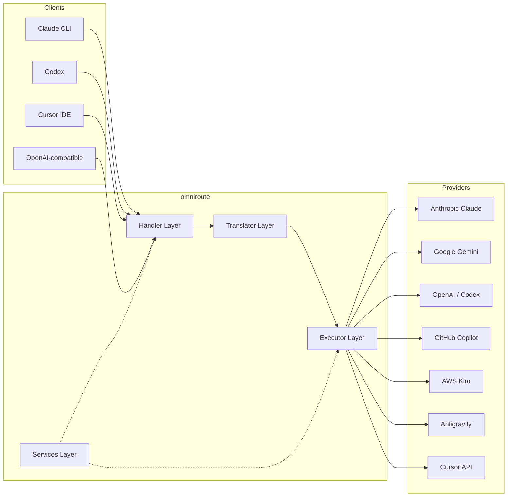

### Основен принцип: Превод на централно ниво

Всички преводи на формати преминават през **OpenAI формат като център**:

```
Client Format → [OpenAI Hub] → Provider Format    (request)
Provider Format → [OpenAI Hub] → Client Format    (response)
```

Това означава, че имате нужда само от **N преводачи** (по един на формат) вместо от **N²** (всяка двойка).

---

## 3. Структура на проекта

```
omniroute/
├── open-sse/                  ← Core proxy library (portable, framework-agnostic)
│   ├── index.js               ← Main entry point, exports everything
│   ├── config/                ← Configuration & constants
│   ├── executors/             ← Provider-specific request execution
│   ├── handlers/              ← Request handling orchestration
│   ├── services/              ← Business logic (auth, models, fallback, usage)
│   ├── translator/            ← Format translation engine
│   │   ├── request/           ← Request translators (8 files)
│   │   ├── response/          ← Response translators (7 files)
│   │   └── helpers/           ← Shared translation utilities (6 files)
│   └── utils/                 ← Utility functions
├── src/                       ← Application layer (Express/Worker runtime)
│   ├── app/                   ← Web UI, API routes, middleware
│   ├── lib/                   ← Database, auth, and shared library code
│   ├── mitm/                  ← Man-in-the-middle proxy utilities
│   ├── models/                ← Database models
│   ├── shared/                ← Shared utilities (wrappers around open-sse)
│   ├── sse/                   ← SSE endpoint handlers
│   └── store/                 ← State management
├── data/                      ← Runtime data (credentials, logs)
│   └── provider-credentials.json   (external credentials override, gitignored)
└── tester/                    ← Test utilities
```

---

## 4. Разбивка модул по модул

### 4.1 Конфигурация (`open-sse/config/`)

**Единственият източник на истина** за всички конфигурации на доставчика.

| Файл                          | Цел                                                                                                                                                                                                                                                            |
| ----------------------------- | -------------------------------------------------------------------------------------------------------------------------------------------------------------------------------------------------------------------------------------------------------------- |
| `constants.ts`                | `PROVIDERS` обект с основни URL адреси, идентификационни данни за OAuth (по подразбиране), заглавки и системни подкани по подразбиране за всеки доставчик. Също така дефинира `HTTP_STATUS`, `ERROR_TYPES`, `COOLDOWN_MS`, `BACKOFF_CONFIG` и `SKIP_PATTERNS`. |
| `credentialLoader.ts`         | Зарежда външни идентификационни данни от `data/provider-credentials.json` и ги обединява върху твърдо кодираните настройки по подразбиране в `PROVIDERS`. Пази тайните извън контрола на източника, като същевременно поддържа обратна съвместимост.           |
| `providerModels.ts`           | Централен регистър на моделите: псевдоними на доставчика на карти → ID на модела. Функции като `getModels()`, `getProviderByAlias()`.                                                                                                                          |
| `codexInstructions.ts`        | Системни инструкции, инжектирани в заявките на Codex (ограничения за редактиране, правила на пясъчника, правила за одобрение).                                                                                                                                 |
| `defaultThinkingSignature.ts` | „Мислещи“ подписи по подразбиране за модели Claude и Gemini.                                                                                                                                                                                                   |
| `ollamaModels.ts`             | Дефиниция на схема за локални модели Ollama (име, размер, семейство, квантуване).                                                                                                                                                                              |

#### Поток на зареждане на идентификационни данни

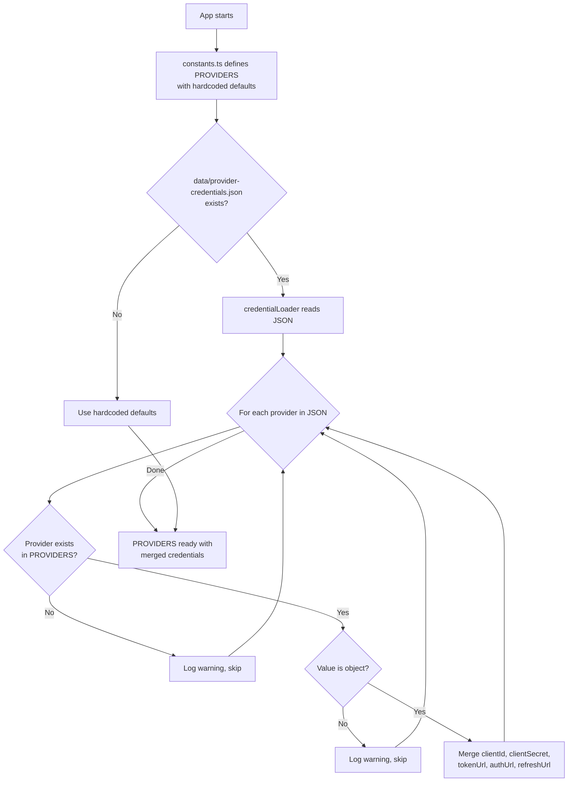

---

### 4.2 Изпълнители (`open-sse/executors/`)

Изпълнителите капсулират **специфична за доставчика логика**, използвайки **стратегически модел**. Всеки изпълнител замества основните методи, ако е необходимо.

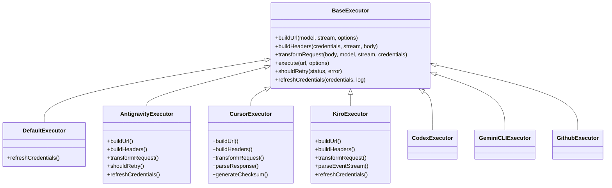

| Изпълнител       | Доставчик                                  | Ключови специализации                                                                                                                                                                 |
| ---------------- | ------------------------------------------ | ------------------------------------------------------------------------------------------------------------------------------------------------------------------------------------- |
| `base.ts`        | —                                          | Абстрактна база: изграждане на URL, заглавки, логика за повторен опит, опресняване на идентификационни данни                                                                          |
| `default.ts`     | Claude, Gemini, OpenAI, GLM, Kimi, MiniMax | Генерично опресняване на OAuth токен за стандартни доставчици                                                                                                                         |
| `antigravity.ts` | Google Cloud Code                          | Генериране на идентификатор на проект/сесия, резервен URL адрес с множество URL адреси, персонализирано анализиране на повторен опит от съобщения за грешка („нулиране след 2h7m23s“) |
| `cursor.ts`      | Курсор IDE                                 | **Най-сложни**: SHA-256 контролна сума auth, Protobuf кодиране на заявка, двоичен EventStream → SSE отговор анализ                                                                    |
| `codex.ts`       | OpenAI Codex                               | Вкарва системни инструкции, управлява нивата на мислене, премахва неподдържаните параметри                                                                                            |
| `gemini-cli.ts`  | Google Gemini CLI                          | Изграждане на персонализиран URL (`streamGenerateContent`), опресняване на Google OAuth токен                                                                                         |
| `github.ts`      | Копилот на GitHub                          | Система с двоен токен (GitHub OAuth + Copilot token), имитиране на заглавката на VSCode                                                                                               |
| `kiro.ts`        | AWS CodeWhisperer                          | Двоичен анализ на AWS EventStream, рамки за събития AMZN, оценка на токена                                                                                                            |
| `index.ts`       | —                                          | Фабрика: картографира името на доставчика → клас изпълнител, с резервен вариант по подразбиране                                                                                       |

---

### 4.3 Манипулатори (`open-sse/handlers/`)

**Слоят за оркестрация** — координира превода, изпълнението, поточното предаване и обработката на грешки.

| Файл                  | Цел                                                                                                                                                                                                                                                     |
| --------------------- | ------------------------------------------------------------------------------------------------------------------------------------------------------------------------------------------------------------------------------------------------------- |
| `chatCore.ts`         | **Централен оркестратор** (~600 реда). Обработва пълния жизнен цикъл на заявката: откриване на формат → превод → изпращане на изпълнител → стрийминг/не-стрийминг отговор → опресняване на токена → обработка на грешки → регистриране на използването. |
| `responsesHandler.ts` | Адаптер за API за отговори на OpenAI: преобразува формата на отговорите → Завършвания на чат → изпраща до `chatCore` → конвертира SSE обратно във формат на отговорите.                                                                                 |
| `embeddings.ts`       | Манипулатор за генериране на вграждане: разрешава модел на вграждане → доставчик, изпраща до API на доставчика, връща съвместим с OpenAI отговор за вграждане. Поддържа 6+ доставчици.                                                                  |
| `imageGeneration.ts`  | Манипулатор за генериране на изображения: разрешава модел на изображение → доставчик, поддържа режими, съвместими с OpenAI, Gemini-image (Антигравитация) и резервни (Nebius). Връща base64 или URL изображения.                                        |

#### Жизнен цикъл на заявка (chatCore.ts)

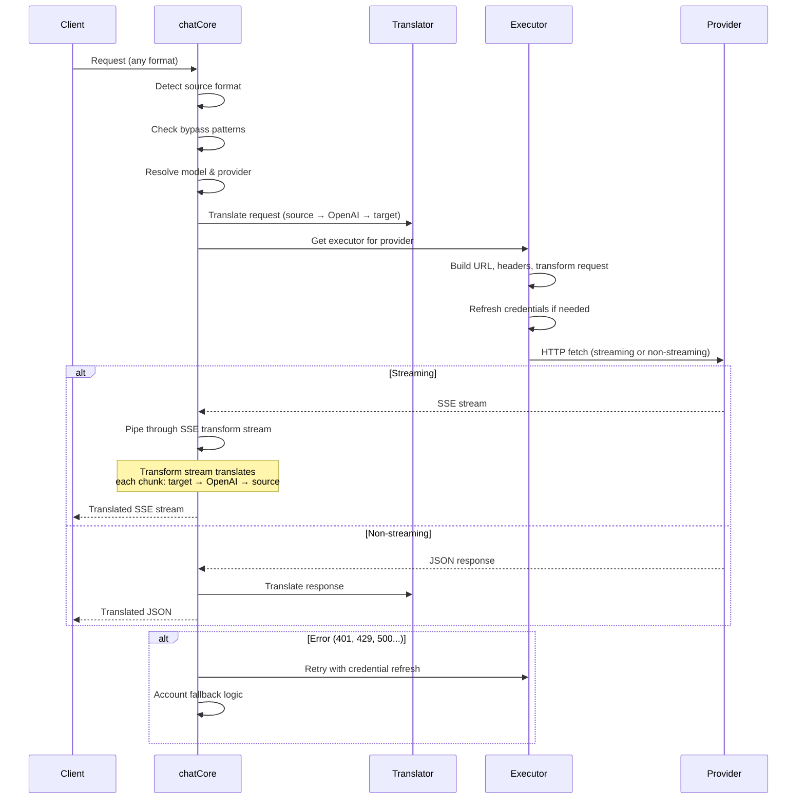

---

### 4.4 Услуги (`open-sse/services/`)

Бизнес логика, която поддържа манипулаторите и изпълнителите.

| Файл                 | Цел                                                                                                                                                                                                                                                                                                                                                                                                 |
| -------------------- | --------------------------------------------------------------------------------------------------------------------------------------------------------------------------------------------------------------------------------------------------------------------------------------------------------------------------------------------------------------------------------------------------- |
| `provider.ts`        | **Откриване на формат** (`detectFormat`): анализира структурата на тялото на заявката, за да идентифицира форматите Claude/OpenAI/Gemini/Antigravity/Responses (включва `max_tokens` евристика за Claude). Също така: изграждане на URL адреси, изграждане на заглавки, нормализиране на конфигурацията на мислене. Поддържа `openai-compatible-*` и `anthropic-compatible-*` динамични доставчици. |
| `model.ts`           | Разбор на низ на модел (`claude/model-name` → `{provider: "claude", model: "model-name"}`), разрешаване на псевдоними с откриване на сблъсък, дезинфекция на входа (отхвърля преминаване на пътя/контролни знаци) и разрешаване на информация за модела с поддръжка на асинхронно получаване на псевдоними.                                                                                         |
| `accountFallback.ts` | Обработка на ограничение на скоростта: експоненциално забавяне (1s → 2s → 4s → макс. 2min), управление на изчакване на акаунта, класификация на грешките (кои грешки задействат резервно или не).                                                                                                                                                                                                   |
| `tokenRefresh.ts`    | Опресняване на OAuth токена за **всеки доставчик**: Google (Gemini, Antigravity), Claude, Codex, Qwen, iFlow, GitHub (OAuth + Copilot dual-token), Kiro (AWS SSO OIDC + Social Auth). Включва кеш за дедупликация на обещание по време на полет и повторен опит с експоненциално забавяне.                                                                                                          |
| `combo.ts`           | **Комбинирани модели**: вериги от резервни модели. Ако модел A се провали с допустима грешка за резервен вариант, опитайте модел B, след това C и т.н. Връща действителните кодове за състояние нагоре по веригата.                                                                                                                                                                                 |
| `usage.ts`           | Извлича данни за квоти/използване от API на доставчика (квоти на GitHub Copilot, квоти на модела на Antigravity, ограничения на скоростта на Codex, разбивки на използването на Kiro, настройки на Claude).                                                                                                                                                                                         |
| `accountSelector.ts` | Интелигентен избор на акаунт с алгоритъм за точкуване: взема предвид приоритет, здравословно състояние, кръгова позиция и състояние на изчакване, за да избере оптималния акаунт за всяка заявка.                                                                                                                                                                                                   |
| `contextManager.ts`  | Управление на жизнения цикъл на контекста на заявката: създава и проследява контекстни обекти на заявка с метаданни (идентификатор на заявка, времеви клейма, информация за доставчика) за отстраняване на грешки и регистриране.                                                                                                                                                                   |
| `ipFilter.ts`        | IP-базиран контрол на достъпа: поддържа разрешени и блокирани режими. Валидира клиентския IP адрес спрямо конфигурирани правила, преди да обработи API заявки.                                                                                                                                                                                                                                      |
| `sessionManager.ts`  | Проследяване на сесии с пръстов отпечатък на клиента: проследява активни сесии с помощта на хеширани клиентски идентификатори, следи броя на заявките и предоставя показатели за сесиите.                                                                                                                                                                                                           |
| `signatureCache.ts`  | Кеш за дедупликация, базиран на подписи на заявки: предотвратява дублиране на заявки чрез кеширане на подписи на скорошни заявки и връщане на кеширани отговори за идентични заявки в рамките на времеви прозорец.                                                                                                                                                                                  |
| `systemPrompt.ts`    | Инжектиране на глобална системна подкана: добавя пред или добавя конфигурируема системна подкана към всички заявки, с обработка на съвместимостта за всеки доставчик.                                                                                                                                                                                                                               |
| `thinkingBudget.ts`  | Управление на бюджета на токените за разсъждение: поддържа режими за преминаване, автоматичен (конфигурация на лентово мислене), персонализиран (фиксиран бюджет) и адаптивен (мащабиран според сложността) режими за контролиране на токени за мислене/разсъждение.                                                                                                                                |
| `wildcardRouter.ts`  | Маршрутизиране на модела със заместващи знаци: разрешава шаблони със заместващи знаци (напр. `*/claude-*`) до конкретни двойки доставчик/модел въз основа на наличност и приоритет.                                                                                                                                                                                                                 |

#### Дедупликация на опресняване на токени

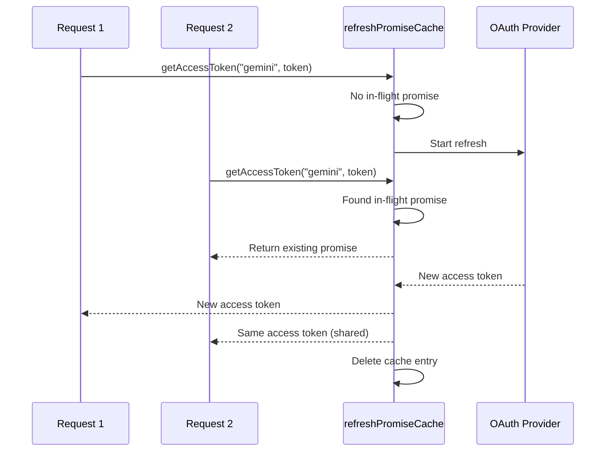

#### Резервна държавна машина на акаунта

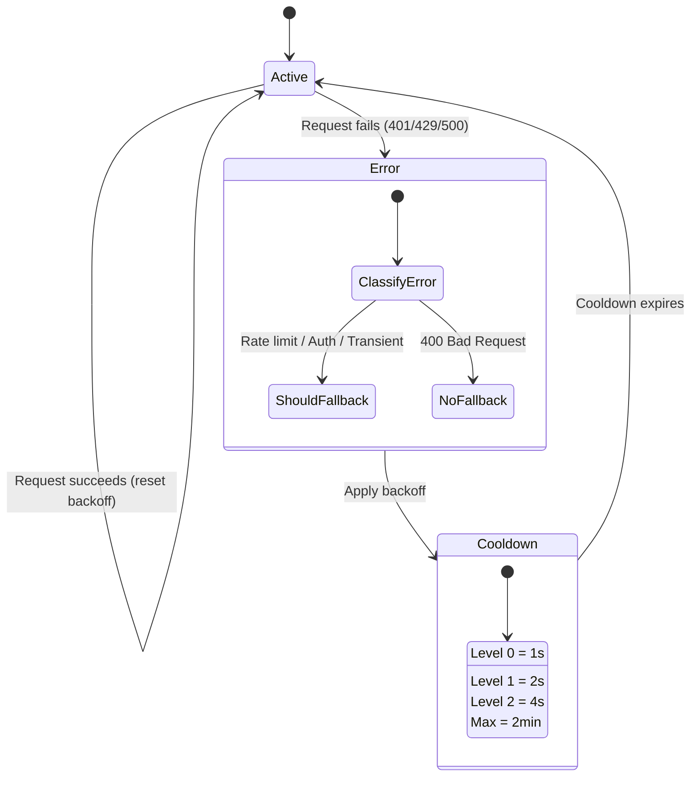

#### Комбиниран модел верига

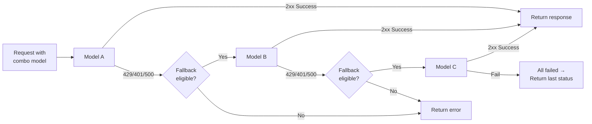

---

### 4.5 Преводач (`open-sse/translator/`)

**Машината за превод на формати**, използваща саморегистрираща се плъгин система.

#### Архитектура

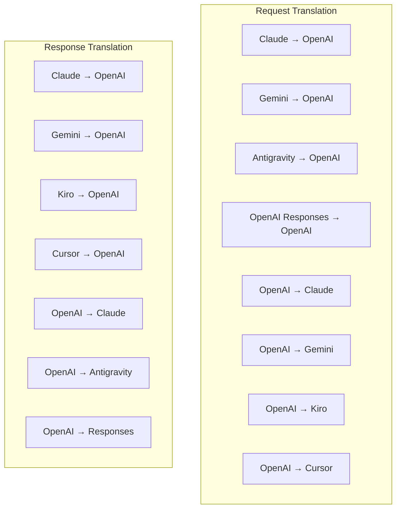

| Указател     | Файлове     | Описание                                                                                                                                                                                                                                                                                                 |
| ------------ | ----------- | -------------------------------------------------------------------------------------------------------------------------------------------------------------------------------------------------------------------------------------------------------------------------------------------------------- |
| `request/`   | 8 преводачи | Преобразувайте тела на заявки между формати. Всеки файл се саморегистрира чрез `register(from, to, fn)` при импортиране.                                                                                                                                                                                 |
| `response/`  | 7 преводачи | Преобразувайте поточно предавани отговори между формати. Обработва SSE типове събития, мисловни блокове, извиквания на инструменти.                                                                                                                                                                      |
| `helpers/`   | 6 помощника | Споделени помощни програми: `claudeHelper` (извличане на системни подкани, мислеща конфигурация), `geminiHelper` (съпоставяне на части/съдържание), `openaiHelper` (филтриране на формат), `toolCallHelper` (генериране на ID, инжектиране на липсващ отговор), `maxTokensHelper`, `responsesApiHelper`. |
| `index.ts`   | —           | Механизъм за превод: `translateRequest()`, `translateResponse()`, управление на състоянието, регистър.                                                                                                                                                                                                   |
| `formats.ts` | —           | Константи на формата: `OPENAI`, `CLAUDE`, `GEMINI`, `ANTIGRAVITY`, `KIRO`, `CURSOR`, `OPENAI_RESPONSES`.                                                                                                                                                                                                 |

#### Ключов дизайн: Саморегистриращи се добавки

```javascript
// Each translator file calls register() on import:
import { register } from "../index.js";
register("claude", "openai", translateClaudeToOpenAI);

// The index.js imports all translator files, triggering registration:
import "./request/claude-to-openai.js"; // ← self-registers
```

---

### 4.6 Помощни средства (`open-sse/utils/`)

| Файл               | Цел                                                                                                                                                                                                                                                                                                                                                    |
| ------------------ | ------------------------------------------------------------------------------------------------------------------------------------------------------------------------------------------------------------------------------------------------------------------------------------------------------------------------------------------------------ |
| `error.ts`         | Изграждане на отговор при грешка (съвместим с OpenAI формат), анализиране на грешка нагоре по веригата, извличане на времето за повторен опит на Antigravity от съобщения за грешка, поточно предаване на грешка на SSE.                                                                                                                               |
| `stream.ts`        | **SSE Transform Stream** — основният тръбопровод за стрийминг. Два режима: `TRANSLATE` (превод в пълен формат) и `PASSTHROUGH` (нормализиране + извличане на използването). Управлява буфериране на парчета, оценка на използването, проследяване на дължината на съдържанието. Екземплярите на енкодер/декодер на поток избягват споделено състояние. |
| `streamHelpers.ts` | Помощни програми за SSE на ниско ниво: `parseSSELine` (толерантни към бели интервали), `hasValuableContent` (филтрира празни парчета за OpenAI/Claude/Gemini), `fixInvalidId`, `formatSSE` (сериализация на SSE, съобразена с формата с `perf_metrics` почистване).                                                                                    |
| `usageTracking.ts` | Извличане на използване на токени от всеки формат (Claude/OpenAI/Gemini/Responses), оценка с отделни съотношения на инструмент/съобщение char-per-token, добавяне на буфер (марж за безопасност от 2000 токена), филтриране на специфично за формат поле, конзолно регистриране с ANSI цветове.                                                        |
| `requestLogger.ts` | Регистриране на искания на базата на файл (включване чрез `ENABLE_REQUEST_LOGS=true`). Създава сесийни папки с номерирани файлове: `1_req_client.json` → `7_res_client.txt`. Всички I/O са асинхронни (задействай и забрави). Маскира чувствителните заглавки.                                                                                         |
| `bypassHandler.ts` | Прихваща специфични модели от Claude CLI (извличане на заглавие, загряване, броене) и връща фалшиви отговори, без да се обажда на доставчик. Поддържа както стрийминг, така и не стрийминг. Умишлено ограничен до Claude CLI обхват.                                                                                                                   |
| `networkProxy.ts`  | Разрешава URL адрес на изходящ прокси за даден доставчик с приоритет: специфична за доставчика конфигурация → глобална конфигурация → променливи на средата (`HTTPS_PROXY`/`HTTP_PROXY`/`ALL_PROXY`). Поддържа `NO_PROXY` изключения. Кешира конфигурацията за 30s.                                                                                    |

#### SSE Streaming Pipeline

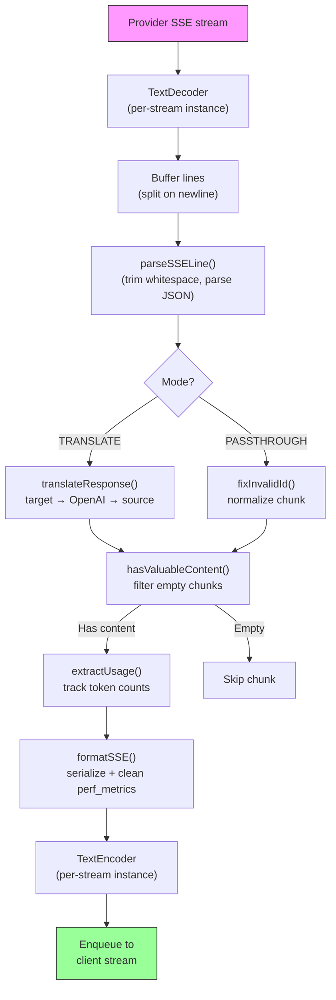

#### Структура на сесията на регистратора на заявка

```
logs/
└── claude_gemini_claude-sonnet_20260208_143045/
    ├── 1_req_client.json      ← Raw client request
    ├── 2_req_source.json      ← After initial conversion
    ├── 3_req_openai.json      ← OpenAI intermediate format
    ├── 4_req_target.json      ← Final target format
    ├── 5_res_provider.txt     ← Provider SSE chunks (streaming)
    ├── 5_res_provider.json    ← Provider response (non-streaming)
    ├── 6_res_openai.txt       ← OpenAI intermediate chunks
    ├── 7_res_client.txt       ← Client-facing SSE chunks
    └── 6_error.json           ← Error details (if any)
```

---

### 4.7 Приложен слой (`src/`)

| Указател      | Цел                                                                                                          |
| ------------- | ------------------------------------------------------------------------------------------------------------ |
| `src/app/`    | Уеб потребителски интерфейс, API маршрути, Express междинен софтуер, манипулатори за обратно извикване OAuth |
| `src/lib/`    | Достъп до база данни (`localDb.ts`, `usageDb.ts`), удостоверяване, споделено                                 |
| `src/mitm/`   | Прокси помощни програми Man-in-the-middle за прихващане на трафик на доставчик                               |
| `src/models/` | Дефиниции на модел на база данни                                                                             |
| `src/shared/` | Обвивки около open-sse функции (доставчик, поток, грешка и др.)                                              |
| `src/sse/`    | SSE манипулатори на крайни точки, които свързват библиотеката open-sse към експресни маршрути                |
| `src/store/`  | Управление на състоянието на приложението                                                                    |

#### Известни API маршрути

| Маршрут                                       | Методи                           | Цел                                                                                                     |
| --------------------------------------------- | -------------------------------- | ------------------------------------------------------------------------------------------------------- |
| `/api/provider-models`                        | ПОЛУЧАВАНЕ/ПУБЛИКУВАНЕ/ИЗТРИВАНЕ | CRUD за потребителски модели на доставчик                                                               |
| `/api/models/catalog`                         | ВЗЕМЕТЕ                          | Обобщен каталог на всички модели (чат, вграждане, изображение, персонализирани), групирани по доставчик |
| `/api/settings/proxy`                         | ПОЛУЧАВАНЕ/ПОСТАВЯНЕ/ИЗТРИВАНЕ   | Конфигурация на йерархичен изходящ прокси (`global/providers/combos/keys`)                              |
| `/api/settings/proxy/test`                    | ПУБЛИКАЦИЯ                       | Потвърждава прокси свързаността и връща публичен IP/латентност                                          |
| `/v1/providers/[provider]/chat/completions`   | ПУБЛИКАЦИЯ                       | Специализирани завършвания на чат за всеки доставчик с валидиране на модел                              |
| `/v1/providers/[provider]/embeddings`         | ПУБЛИКАЦИЯ                       | Специализирани вграждания за всеки доставчик с валидиране на модел                                      |
| `/v1/providers/[provider]/images/generations` | ПУБЛИКАЦИЯ                       | Специално генериране на изображения за всеки доставчик с валидиране на модел                            |
| `/api/settings/ip-filter`                     | ВЗЕМИ/ПОСТАВИ                    | Управление на списък с разрешени/блокирани IP                                                           |
| `/api/settings/thinking-budget`               | ВЗЕМИ/ПОСТАВИ                    | Конфигурация на бюджета на токена за разсъждение (пропускане/автоматично/персонализирано/адаптивно)     |
| `/api/settings/system-prompt`                 | ВЗЕМИ/ПОСТАВИ                    | Бързо инжектиране на глобална система за всички заявки                                                  |
| `/api/sessions`                               | ВЗЕМЕТЕ                          | Проследяване на активна сесия и показатели                                                              |
| `/api/rate-limits`                            | ВЗЕМЕТЕ                          | Състояние на ограничение на лимита по сметка                                                            |

---

## 5. Ключови модели на дизайн

### 5.1 Hub-and-Spoke превод

Всички формати се превеждат през **OpenAI формат като център**. Добавянето на нов доставчик изисква само писане на **една двойка** преводачи (към/от OpenAI), а не на N двойки.

### 5.2 Модел на стратегия за изпълнител

Всеки доставчик има специален клас изпълнител, наследен от `BaseExecutor`. Фабриката в `executors/index.ts` избира правилния по време на изпълнение.

### 5.3 Саморегистрираща се плъгин система

Модулите за преводач се регистрират при импортиране чрез `register()`. Добавянето на нов преводач е просто създаване на файл и импортирането му.

### 5.4 Резервен акаунт с експоненциално отстъпление

Когато доставчикът върне 429/401/500, системата може да превключи към следващия акаунт, прилагайки експоненциално охлаждане (1s → 2s → 4s → max 2min).

### Комбинирани вериги за модели 5.5

„Комбо“ групира множество низове `provider/model`. Ако първият не успее, автоматично се върнете към следващия.

### 5.6 Поточен превод с пълно състояние

Преводът на отговор поддържа състоянието в SSE блокове (проследяване на мислещ блок, натрупване на извикване на инструмент, индексиране на блок съдържание) чрез механизма `initState()`.

### 5.7 Буфер за безопасност при използване

Добавя се буфер от 2000 токена към отчетеното използване, за да се предотврати достигането на ограниченията на контекстните прозорци на клиентите поради натоварване от системни подкани и превод на формати.

---

## 6. Поддържани формати

| Формат                    | Посока         | Идентификатор      |
| ------------------------- | -------------- | ------------------ |
| Завършвания на OpenAI чат | източник + цел | `openai`           |
| OpenAI Responses API      | източник + цел | `openai-responses` |
| Антропичен Клод           | източник + цел | `claude`           |
| Google Gemini             | източник + цел | `gemini`           |
| Google Gemini CLI         | само цел       | `gemini-cli`       |
| Антигравитация            | източник + цел | `antigravity`      |
| AWS Киро                  | само цел       | `kiro`             |
| Курсор                    | само цел       | `cursor`           |

---

## 7. Поддържани доставчици

| Доставчик                | Метод за удостоверяване          | Изпълнител      | Основни бележки                                    |
| ------------------------ | -------------------------------- | --------------- | -------------------------------------------------- |
| Антропичен Клод          | API ключ или OAuth               | По подразбиране | Използва `x-api-key` заглавка                      |
| Google Gemini            | API ключ или OAuth               | По подразбиране | Използва `x-goog-api-key` заглавка                 |
| Google Gemini CLI        | OAuth                            | GeminiCLI       | Използва `streamGenerateContent` крайна точка      |
| Антигравитация           | OAuth                            | Антигравитация  | Multi-URL резервен, персонализиран повторен анализ |
| OpenAI                   | API ключ                         | По подразбиране | Удостоверяване на стандартен носител               |
| Кодекс                   | OAuth                            | Кодекс          | Инжектира системни инструкции, управлява мисленето |
| Копилот на GitHub        | OAuth + Copilot token            | Github          | Двоен токен, имитираща заглавка на VSCode          |
| Киро (AWS)               | AWS SSO OIDC или социални        | Киро            | Парсинг на двоичен EventStream                     |
| Курсор IDE               | Контролна сума за удостоверяване | Курсор          | Protobuf кодиране, SHA-256 контролни суми          |
| Куен                     | OAuth                            | По подразбиране | Стандартно удостоверяване                          |
| iFlow                    | OAuth (основен + носител)        | По подразбиране | Заглавка за двойно удостоверяване                  |
| OpenRouter               | API ключ                         | По подразбиране | Удостоверяване на стандартен носител               |
| GLM, Kimi, MiniMax       | API ключ                         | По подразбиране | Съвместим с Claude, използвайте `x-api-key`        |
| `openai-compatible-*`    | API ключ                         | По подразбиране | Динамично: всяка крайна точка, съвместима с OpenAI |
| `anthropic-compatible-*` | API ключ                         | По подразбиране | Динамично: всяка крайна точка, съвместима с Claude |

---

## 8. Резюме на потока от данни

### Заявка за поточно предаване

```mermaid
flowchart LR
    A["Client"] --> B["detectFormat()"]
    B --> C["translateRequest()\nsource → OpenAI → target"]
    C --> D["Executor\nbuildUrl + buildHeaders"]
    D --> E["fetch(providerURL)"]
    E --> F["createSSEStream()\nTRANSLATE mode"]
    F --> G["parseSSELine()"]
    G --> H["translateResponse()\ntarget → OpenAI → source"]
    H --> I["extractUsage()\n+ addBuffer"]
    I --> J["formatSSE()"]
    J --> K["Client receives\ntranslated SSE"]
    K --> L["logUsage()\nsaveRequestUsage()"]
```

### Заявка без поточно предаване

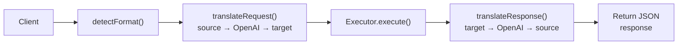

### Байпасен поток (Claude CLI)

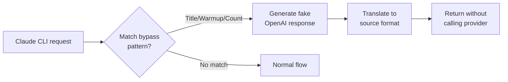
